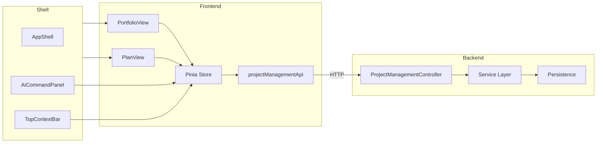

# Project Management Design

## Purpose

Concrete implementation design for the Project Management slice — file structure, component API contracts, visual decisions, data contracts with the backend, state / error / empty design, and database schema references. This doc is the bridge between [project-management-spec.md](../03-spec/project-management-spec.md), the architecture trio ([architecture](../04-architecture/project-management-architecture.md), [data flow](../04-architecture/project-management-data-flow.md), [data model](../04-architecture/project-management-data-model.md)), and the API contract in [contracts/project-management-API_IMPLEMENTATION_GUIDE.md](contracts/project-management-API_IMPLEMENTATION_GUIDE.md).

## Traceability

- Spec: [../03-spec/project-management-spec.md](../03-spec/project-management-spec.md)
- Architecture: [../04-architecture/project-management-architecture.md](../04-architecture/project-management-architecture.md)
- Data model: [../04-architecture/project-management-data-model.md](../04-architecture/project-management-data-model.md)
- Visual design system: [design.md](design.md) (project-wide)
- Sibling slice conventions: [project-space-design.md](project-space-design.md)

---

## 1. Frontend File Structure

```
frontend/src/features/project-management/
├── ProjectManagementPortfolioView.vue        // route: /project-management
├── ProjectManagementPlanView.vue             // route: /project-management/:projectId
├── components/
│   ├── portfolio/
│   │   ├── PortfolioSummaryBar.vue
│   │   ├── PortfolioMilestoneHeatmap.vue
│   │   ├── HeatmapCell.vue
│   │   ├── PortfolioCapacityMatrix.vue
│   │   ├── CapacityMatrixRow.vue
│   │   ├── PortfolioRiskConcentration.vue
│   │   ├── PortfolioRiskRow.vue
│   │   ├── RiskSeverityCategoryHeatmap.vue
│   │   ├── PortfolioDependencyBottlenecks.vue
│   │   ├── BottleneckRow.vue
│   │   └── PortfolioDeliveryCadence.vue
│   ├── plan/
│   │   ├── PlanHeader.vue
│   │   ├── MilestonePlanner.vue
│   │   ├── MilestoneRow.vue
│   │   ├── MilestoneEditor.vue
│   │   ├── MilestoneStatusChip.vue
│   │   ├── SlippagePredictionChip.vue
│   │   ├── CapacityAllocationEditor.vue
│   │   ├── CapacityCell.vue
│   │   ├── RiskRegistryEditor.vue
│   │   ├── RiskRow.vue
│   │   ├── RiskEditor.vue
│   │   ├── RiskStateChip.vue
│   │   ├── DependencyResolver.vue
│   │   ├── DependencyRow.vue
│   │   ├── DependencyEditor.vue
│   │   ├── DependencyResolutionChip.vue
│   │   ├── DeliveryProgressStrip.vue
│   │   ├── ProgressNode.vue
│   │   ├── PlanChangeLog.vue
│   │   ├── ChangeLogEntryRow.vue
│   │   ├── PlanAiSuggestionsPanel.vue
│   │   └── AiSuggestionChip.vue
│   └── shared/
│       ├── PmCard.vue                        // wrapper with loading / error / empty states
│       ├── InlineNumberInput.vue
│       ├── InlineDateInput.vue
│       ├── JustificationDialog.vue
│       └── UnsavedChangesGuard.vue
├── composables/
│   ├── usePlanStateMachine.ts                // allowed-transitions helper
│   ├── useOptimisticMutation.ts
│   └── usePlanFilters.ts                     // query-param filters
├── stores/
│   └── projectManagementStore.ts             // Pinia store
├── api/
│   └── projectManagementApi.ts               // API client, mock-aware
├── types/
│   ├── enums.ts
│   ├── portfolio.ts
│   ├── plan.ts
│   └── requests.ts
├── mocks/
│   ├── portfolioAggregate.mock.ts
│   ├── planAggregate.mock.ts
│   ├── milestones.mock.ts
│   ├── risks.mock.ts
│   ├── dependencies.mock.ts
│   └── aiSuggestions.mock.ts
└── __tests__/
    ├── usePlanStateMachine.spec.ts
    ├── MilestonePlanner.spec.ts
    ├── CapacityAllocationEditor.spec.ts
    └── RiskRegistryEditor.spec.ts
```

### Router wiring (excerpt)

```typescript
// frontend/src/router/index.ts
{
  path: '/project-management',
  component: () => import('@/features/project-management/ProjectManagementPortfolioView.vue'),
  meta: { title: 'Project Management', role: 'WORKSPACE_READ' }
},
{
  path: '/project-management/:projectId',
  component: () => import('@/features/project-management/ProjectManagementPlanView.vue'),
  meta: { title: 'Plan', role: 'PROJECT_READ' },
  props: true
}
```

---

## 2. Component API Contracts

### 2.1 Portfolio view

| Component | Props | Emits | Source |
|-----------|-------|-------|--------|
| `ProjectManagementPortfolioView` | none (reads `workspaceId` from shell store) | — | `store.portfolioAggregate` |
| `PortfolioSummaryBar` | `summary: SectionResult<PortfolioSummary>`, `onFilter` | `filter` | `store.portfolioAggregate.summary` |
| `PortfolioMilestoneHeatmap` | `heatmap: SectionResult<PortfolioHeatmap>`, `onCellClick` | `drill` | store |
| `HeatmapCell` | `cell: HeatmapCell`, `projectName` | — | — |
| `PortfolioCapacityMatrix` | `capacity: SectionResult<PortfolioCapacity>`, `onEditInPlan(projectId)` | `editInPlan` | store |
| `PortfolioRiskConcentration` | `risks: SectionResult<PortfolioRiskConcentration>`, `onDrillRisk` | `drillRisk` | store |
| `PortfolioDependencyBottlenecks` | `bottlenecks: SectionResult<BottleneckItem[]>`, `onOpenResolver` | `openResolver` | store |
| `PortfolioDeliveryCadence` | `cadence: SectionResult<CadenceMetric[]>` | — | store |

### 2.2 Plan view

| Component | Props | Emits | Source |
|-----------|-------|-------|--------|
| `ProjectManagementPlanView` | `projectId` (route prop) | — | `store.planAggregate[projectId]` |
| `PlanHeader` | `header: SectionResult<PlanHeader>` | — | store |
| `MilestonePlanner` | `milestones: SectionResult<Milestone[]>`, `revision: number` | `create`, `update(id, patch)`, `transition(id, to, reason, newDate?)`, `archive(id)`, `reorder(ids)` | store |
| `MilestoneRow` | `milestone: Milestone`, `editable: boolean` | domain events | — |
| `MilestoneEditor` | `initial: Partial<Milestone>`, `mode: 'CREATE' \| 'UPDATE'` | `save`, `cancel` | — |
| `SlippagePredictionChip` | `slippage: SlippagePrediction \| null` | `accept`, `dismiss(reason?)` | store |
| `CapacityAllocationEditor` | `capacity: SectionResult<PlanCapacityMatrix>` | `batchUpdate(edits)` | store |
| `CapacityCell` | `cell`, `row`, `column`, `editable`, `requiresJustification` | `edit(percent, justification?)` | — |
| `RiskRegistryEditor` | `risks: SectionResult<Risk[]>` | `create`, `update(id, patch)`, `transition(id, to, noteFields)`, `escalate(id, reason)` | store |
| `DependencyResolver` | `deps: SectionResult<Dependency[]>` | `create`, `update(id, patch)`, `transition(id, to, fields)`, `countersign(id)` | store |
| `DeliveryProgressStrip` | `progress: SectionResult<DeliveryProgressNode[]>` | `openNode(node)` | store |
| `PlanChangeLog` | `page: SectionResult<ChangeLogPage>`, `filters` | `pageChange`, `filterChange` | store |
| `PlanAiSuggestionsPanel` | `suggestions: SectionResult<AiSuggestion[]>` | `accept(id)`, `dismiss(id, reason)` | store |

### 2.3 Shared components

`PmCard.vue` — wraps a section and renders a canonical skeleton / empty / error state based on the `SectionResult<T>` envelope.

```vue
<template>
  <section class="pm-card" :aria-busy="status === 'LOADING'">
    <header class="pm-card__header">
      <h3>{{ title }}</h3>
      <slot name="actions" />
    </header>
    <div class="pm-card__body">
      <PmCardSkeleton v-if="status === 'LOADING'" />
      <PmCardEmpty v-else-if="status === 'EMPTY'" :message="emptyMessage" />
      <PmCardError v-else-if="status === 'ERROR'" :error="error" @retry="$emit('retry')" />
      <slot v-else />
    </div>
  </section>
</template>
```

`JustificationDialog.vue` — blocking dialog used by:
- Milestone transition (`AT_RISK`/`SLIPPED` reason)
- Capacity over-allocation
- Risk transition notes
- Dependency rejection reason
- Dependency external contract commitment

`UnsavedChangesGuard.vue` — router-level guard for Plan view; prompts on navigation if `store.hasUnsavedEdits(projectId)`.

---

## 3. Pinia Store Contract

```typescript
// frontend/src/features/project-management/stores/projectManagementStore.ts

export interface ProjectManagementState {
  portfolio: Record<string /* workspaceId */, PortfolioAggregate>;
  plans: Record<string /* projectId */, PlanAggregate>;
  pendingMutations: Record<string /* entity key */, 'SAVING' | 'FAILED'>;
  unsavedEdits: Record<string /* projectId */, boolean>;
  filters: {
    portfolio: PortfolioFilters;
    plan: Record<string, PlanFilters>;
  };
  lastRefreshedAt: Record<string /* scope key */, string>;
}

export const useProjectManagementStore = defineStore('projectManagement', {
  state: (): ProjectManagementState => ({...}),
  actions: {
    // portfolio
    async initPortfolio(workspaceId: string): Promise<void> {},
    async refreshPortfolio(workspaceId: string): Promise<void> {},
    async refreshPortfolioSection(workspaceId: string, section: PortfolioSection): Promise<void> {},

    // plan reads
    async initPlan(projectId: string): Promise<void> {},
    async refreshPlanSection(projectId: string, section: PlanSection): Promise<void> {},

    // plan mutations
    async createMilestone(projectId: string, req: CreateMilestoneRequest): Promise<Milestone> {},
    async updateMilestone(projectId: string, id: string, req: UpdateMilestoneRequest): Promise<Milestone> {},
    async transitionMilestone(projectId: string, id: string, req: TransitionMilestoneRequest): Promise<Milestone> {},
    async archiveMilestone(projectId: string, id: string): Promise<void> {},
    async batchUpdateCapacity(projectId: string, req: CapacityBatchUpdateRequest): Promise<PlanCapacityMatrix> {},
    async createRisk(projectId: string, req: CreateRiskRequest): Promise<Risk> {},
    async updateRisk(projectId: string, id: string, req: UpdateRiskRequest): Promise<Risk> {},
    async transitionRisk(projectId: string, id: string, req: TransitionRiskRequest): Promise<Risk> {},
    async createDependency(projectId: string, req: CreateDependencyRequest): Promise<Dependency> {},
    async updateDependency(projectId: string, id: string, req: UpdateDependencyRequest): Promise<Dependency> {},
    async transitionDependency(projectId: string, id: string, req: TransitionDependencyRequest): Promise<Dependency> {},
    async counterSignDependency(projectId: string, id: string, req: CounterSignRequest): Promise<Dependency> {},

    // AI suggestions
    async acceptAiSuggestion(projectId: string, id: string): Promise<AiSuggestion> {},
    async dismissAiSuggestion(projectId: string, id: string, reason?: string): Promise<AiSuggestion> {},

    // filters / unsaved state
    setPortfolioFilters(f: PortfolioFilters): void {},
    setPlanFilters(projectId: string, f: PlanFilters): void {},
    markUnsaved(projectId: string, v: boolean): void {},
  },
  getters: {
    hasUnsavedEdits: (state) => (projectId: string) => !!state.unsavedEdits[projectId],
    aiPendingReviewCount: (state) => (workspaceId: string) => { /* compute */ },
  }
});
```

All mutation actions follow an optimistic-then-rollback pattern via `useOptimisticMutation` composable. On `PM_STALE_REVISION`, the store refetches the affected section and re-raises a user-visible error.

---

## 4. Data Contracts (high-level)

The full contract is in [contracts/project-management-API_IMPLEMENTATION_GUIDE.md](contracts/project-management-API_IMPLEMENTATION_GUIDE.md). This design doc enumerates which component reads which endpoint:

| Endpoint | Primary Consumer |
|----------|------------------|
| `GET /portfolio?workspaceId=...` | `ProjectManagementPortfolioView` first paint |
| `GET /portfolio/summary?workspaceId=...` | Refresh on `PortfolioSummaryBar` |
| `GET /portfolio/heatmap?workspaceId=...&window=...` | `PortfolioMilestoneHeatmap` |
| `GET /portfolio/capacity?workspaceId=...` | `PortfolioCapacityMatrix` |
| `GET /portfolio/risks?workspaceId=...&limit=20` | `PortfolioRiskConcentration` |
| `GET /portfolio/dependencies?workspaceId=...&limit=15` | `PortfolioDependencyBottlenecks` |
| `GET /portfolio/cadence?workspaceId=...` | `PortfolioDeliveryCadence` |
| `GET /plan/{projectId}` | `ProjectManagementPlanView` first paint |
| `GET /plan/{projectId}/header` | `PlanHeader` refresh |
| `GET /plan/{projectId}/milestones` | `MilestonePlanner` |
| `GET /plan/{projectId}/capacity` | `CapacityAllocationEditor` |
| `GET /plan/{projectId}/risks` | `RiskRegistryEditor` |
| `GET /plan/{projectId}/dependencies` | `DependencyResolver` |
| `GET /plan/{projectId}/progress` | `DeliveryProgressStrip` |
| `GET /plan/{projectId}/change-log?...` | `PlanChangeLog` |
| `GET /plan/{projectId}/ai-suggestions` | `PlanAiSuggestionsPanel` + in-line chips |
| `POST/PATCH/... /plan/{projectId}/milestones...` | `MilestonePlanner` mutations |
| `PATCH /plan/{projectId}/capacity` | `CapacityAllocationEditor` batch |
| `POST/PATCH/... /plan/{projectId}/risks...` | `RiskRegistryEditor` |
| `POST/PATCH/... /plan/{projectId}/dependencies...` | `DependencyResolver` |
| `POST /plan/{projectId}/ai-suggestions/{id}/accept\|dismiss` | `PlanAiSuggestionsPanel`, inline chips |

---

## 5. Visual Design Decisions

### 5.1 Tokens (reuse shared design system)

- **Palette**: Tactical Command dark theme (per [design.md](design.md)).
- **Health LEDs**: Green `--led-green`, Yellow `--led-yellow`, Red `--led-red`, Unknown `--led-neutral`.
- **Crimson accent**: `--accent-crimson` — used for: Slipped milestones, Critical risks, Over-allocation row total, Blocked dependency rows, Rejected state chips.
- **Amber accent**: `--accent-amber` — used for: At-Risk milestones, under-utilization capacity, At-Risk dependency.
- **Spacing**: 8px grid. Card gutter 16px. Internal padding 16–24px.
- **Typography**: workbench-SaaS scale — `--type-xs` / `--type-sm` / `--type-md` / `--type-lg`. Tabular numerals enabled on all numeric columns (`font-variant-numeric: tabular-nums`).
- **Elevation**: subtle 1px border `--border-subtle`; no drop shadows on cards.
- **Grid**: 12-column CSS grid, responsive breakpoints from `design.md`.

### 5.2 Portfolio layout (12-col grid)

| Row | Span | Card |
|-----|------|------|
| 1 | 1–12 | PortfolioSummaryBar |
| 2 | 1–12 | PortfolioMilestoneHeatmap |
| 3 | 1–8 | PortfolioCapacityMatrix |
| 3 | 9–12 | PortfolioDeliveryCadence |
| 4 | 1–7 | PortfolioRiskConcentration |
| 4 | 8–12 | PortfolioDependencyBottlenecks |

### 5.3 Plan layout (12-col grid)

| Row | Span | Card |
|-----|------|------|
| 1 | 1–12 | PlanHeader |
| 2 | 1–12 | DeliveryProgressStrip (slim bar) |
| 3 | 1–8 | MilestonePlanner (primary focus) |
| 3 | 9–12 | PlanAiSuggestionsPanel |
| 4 | 1–12 | CapacityAllocationEditor (wide table) |
| 5 | 1–6 | RiskRegistryEditor |
| 5 | 7–12 | DependencyResolver |
| 6 | 1–12 | PlanChangeLog (collapsible; default collapsed) |

### 5.4 Chip / Row visuals

- **MilestoneStatusChip**: `NOT_STARTED` neutral, `IN_PROGRESS` blue, `AT_RISK` amber, `SLIPPED` crimson, `COMPLETED` green, `ARCHIVED` muted.
- **SlippagePredictionChip**: `LOW` green-muted, `MEDIUM` amber, `HIGH` crimson-muted; expands to factor list; shows `Computing…` until first signal.
- **RiskStateChip**: `IDENTIFIED` neutral, `ACKNOWLEDGED` blue, `MITIGATING` amber, `RESOLVED` green, `ESCALATED` crimson.
- **DependencyResolutionChip**: `PROPOSED` neutral, `NEGOTIATING` blue, `APPROVED` green, `REJECTED` muted, `AT_RISK` amber, `RESOLVED` green-dim.
- **AiSuggestionChip**: sparkle icon + kind label + confidence pill; accept / dismiss inline.
- **Capacity cell**: tabular-nums; over-100 row totals get crimson pill with overage amount; under-threshold totals get amber pill.

### 5.5 Animation & motion

- Optimistic cell writes: 120ms cell-background pulse on commit.
- AI suggestion arrival: 200ms slide-in from the right on PlanAiSuggestionsPanel.
- Chip transitions: 160ms ease-out color change.
- No disruptive motion; respect `prefers-reduced-motion`.

### 5.6 Interaction patterns

- Inline edit everywhere feasible; explicit editors for create / complex multi-field.
- Drag-and-drop reorder for milestones; keyboard fallback via `ordering` number input.
- Debounced batch save for capacity (400ms).
- Confirmation dialogs gated by `JustificationDialog` only where policy requires.

---

## 6. State, Error, and Empty Design

### 6.1 Loading

- Each card shows a `PmCardSkeleton` matching its content shape (rows for tables, grid cells for heatmaps, chips for progress strip).
- First-paint budget respected per REQ-PM-192.

### 6.2 Empty

| Card | Empty message |
|------|---------------|
| PortfolioSummaryBar | "No active projects in this Workspace." (counters rendered as 0) |
| PortfolioMilestoneHeatmap | "No milestones to show in this window." |
| PortfolioCapacityMatrix | "No capacity allocations recorded yet." with CTA "Go to a project's Plan view" |
| PortfolioRiskConcentration | "All green — no active risks across the Workspace." |
| PortfolioDependencyBottlenecks | "No blocked dependencies detected." |
| PortfolioDeliveryCadence | "Not enough data yet — need at least 4 weeks of history." |
| MilestonePlanner | "No milestones yet." with CTA "Create your first milestone" |
| CapacityAllocationEditor | "No members assigned. Manage in Access Management." |
| RiskRegistryEditor | "No active risks." |
| DependencyResolver | "No dependencies configured." |
| PlanChangeLog | "No plan changes recorded in the selected range." |
| PlanAiSuggestionsPanel | "No active AI suggestions. Try the AI Command Panel." |

### 6.3 Error

- Per-card error renders title, short message ("We couldn't load this card."), error code, correlation id, and a "Retry" button.
- The rest of the page remains functional.
- A page-wide "stale" banner appears on the Portfolio view when the last-refreshed timestamp is > 5 minutes old.
- Optimistic mutation failure: row/cell reverts, toast shows short message + correlation id, "Undo" not provided (keeps audit clean).

### 6.4 Authorization

- Unauthorized users see the view but with editor affordances hidden; a soft banner "Read-only view" renders under the Plan Header.
- Attempting a write via keyboard shortcut still triggers the server; the server returns 403 and the UI toasts "Insufficient permissions".

### 6.5 Unsaved changes

- Router guard prompts "You have unsaved changes. Leave without saving?"
- Unsaved state is per `projectId` and is cleared on successful save.

---

## 7. Backend Layout

```
backend/src/main/java/com/sdlctower/domain/projectmanagement/
├── ProjectManagementController.java         // all PM endpoints
├── PlanAccessGuard.java                     // role + isolation
├── service/
│   ├── PortfolioService.java
│   ├── PlanService.java
│   ├── MilestoneService.java
│   ├── CapacityService.java
│   ├── RiskService.java
│   ├── DependencyService.java
│   └── AiSuggestionService.java
├── policy/
│   └── PlanPolicy.java                      // transition + justification rules
├── projection/
│   ├── SummaryProjection.java
│   ├── HeatmapProjection.java
│   ├── CapacityMatrixProjection.java
│   ├── RiskConcentrationProjection.java
│   ├── BottleneckProjection.java
│   ├── CadenceProjection.java
│   └── ProgressStripProjection.java
├── persistence/
│   ├── CapacityAllocationEntity.java
│   ├── CapacityAllocationRepository.java
│   ├── PlanChangeLogEntity.java
│   ├── PlanChangeLogRepository.java
│   ├── AiSuggestionEntity.java
│   └── AiSuggestionRepository.java
├── dto/
│   └── (all request + response DTOs per data-model §4)
├── event/
│   ├── PlanChangeEvent.java
│   └── PlanChangeEventPublisher.java
├── ProjectManagementConstants.java          // API path, budgets
└── ProjectManagementExceptionHandler.java   // mapping to error codes

backend/src/main/resources/db/migration/
├── V20__extend_milestone_for_project_management.sql
├── V21__extend_risk_signal_for_project_management.sql
├── V22__extend_project_dependency_for_project_management.sql
├── V23__create_capacity_allocation.sql
├── V24__create_plan_change_log.sql
├── V25__create_ai_suggestion.sql
└── V26__seed_project_management_sample.sql  // local profile only
```

Reuse: existing `MilestoneRepository`, `RiskSignalRepository`, `ProjectDependencyRepository`, `ProjectRepository`, `MemberRepository`, `RoleAssignmentRepository` from `projectspace`/`access` packages.

---

## 8. Database Schema Summary

See [../04-architecture/project-management-data-model.md](../04-architecture/project-management-data-model.md) §6 for full DDL. Tables touched:

- `milestone` (extended, V20)
- `risk_signal` (extended, V21)
- `project_dependency` (extended, V22)
- `capacity_allocation` (new, V23)
- `plan_change_log` (new, V24)
- `ai_suggestion` (new, V25)

Indexes listed inline in each migration.

---

## 9. Integration Boundary



- Context bar publishes `workspaceId`, `applicationId`, `projectId` to the shell store; PM store subscribes.
- AI Command Panel reads `currentPageContext` from the PM store to populate suggestion chips.
- All HTTP calls carry auth; server is source of truth for authorization.

---

## 10. Accessibility

- All interactive elements have discernible labels and focus rings (`--focus-ring` token).
- Tables use `<table>` markup with proper `<th scope>`; heatmaps use `role="grid"` with `aria-rowindex` / `aria-colindex`.
- Tabular numerals used for all numeric columns to keep digits aligned.
- Color is never the sole indicator: chips always include a textual state label (not only color).
- Keyboard: milestone reorder via `ordering` number input, capacity cells via tab grid, transition menus reachable via arrow keys.
- `prefers-reduced-motion` honored.

---

## 11. Performance

- Debounced capacity batch (400ms) reduces server round-trips.
- Aggregate endpoints return `SectionResult<T>` with per-section errors so UI can render partial results without a reload.
- Optimistic UI for milestones / risks / deps / capacity.
- Backend: 30s Caffeine cache on Portfolio aggregate; Plan aggregate not cached (edit-heavy).
- `planRevision` fencing token on every entity prevents lost updates.

---

## 12. Testing

### Frontend

- Vitest + Vue Testing Library for:
  - `usePlanStateMachine` valid / invalid transitions.
  - `MilestonePlanner` create / update / transition / archive with optimistic rollback.
  - `CapacityAllocationEditor` batch + over-allocation dialog.
  - `RiskRegistryEditor` state transitions including escalation.
  - `DependencyResolver` counter-signature flow.
  - `PlanAiSuggestionsPanel` accept / dismiss with 24h suppression.
- Mock API fixtures under `mocks/` drive all component tests.

### Backend

- Spring Boot tests (`@SpringBootTest` + `@AutoConfigureMockMvc`) for each endpoint including 403 / 409 / 422 paths.
- `PlanPolicy` unit tests for every allowed and rejected transition.
- Flyway migration tests: apply V20–V25 to a fresh H2; verify indexes; verify rollback via compensating migration test.
- Projection tests over a known seed dataset (V26).

---

## 13. Launch Plan / Release Notes Draft

> **Project Management (initial slice)**: Introduces the delivery operating plane. Portfolio view aggregates cross-project slippage, capacity, risk, and dependency signals for PMOs and Application Owners. Plan view lets Project Managers edit milestones, capacity allocation, risks, and dependencies with full audit. AI suggestions for slippage, rebalance, mitigation, and dependency resolution are first-class and suppressible. No WebSocket push in V1; use the refresh button. Multi-project critical path, Gantt, and timesheet ingestion are V2.

---

## 14. Open Design Questions

1. Visual pattern for external vs internal dependency rows — single list with chip, or separate tables? (Proposed: single list with `External` chip; revisit after usability check.)
2. Confirmation copy for risk escalation should probably surface the approver name; do we have a single source for "application owner for this project"? (Assumed yes via role_assignment; confirm with Access Management owner.)
3. Should the Change Log default expanded or collapsed? (Proposed: collapsed to keep Plan view focused on editing; expand on demand.)
4. Is there a "dry-run" mode for AI rebalance suggestions that previews the diff before accept? (V2 candidate.)
