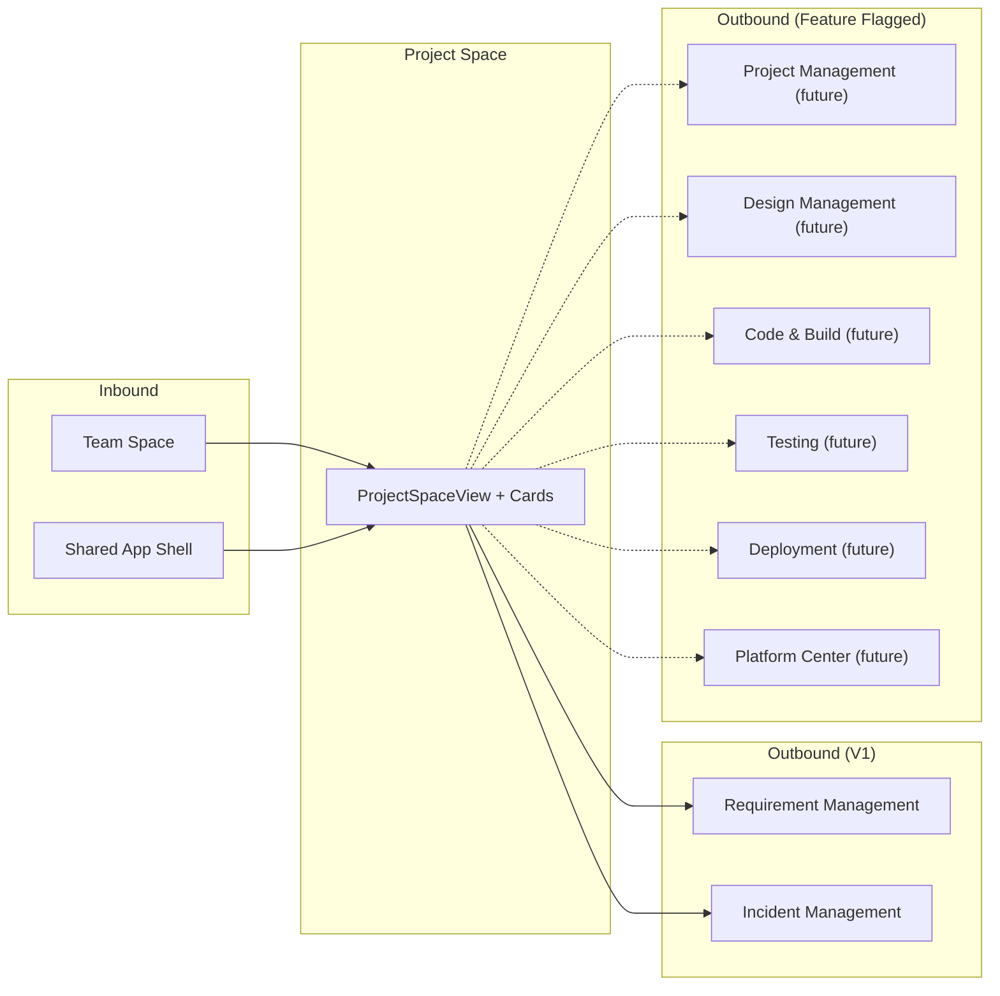

# Project Space Design

## Purpose

This document defines the concrete implementation design of the Project Space slice: file structure, component APIs, state shape, routing, data contracts, visual decisions, database schema summary, error/empty states, and integration boundaries. It is the bridge between the architecture doc and the implementation work.

## Traceability

- Spec: [project-space-spec.md](../03-spec/project-space-spec.md)
- Architecture: [project-space-architecture.md](../04-architecture/project-space-architecture.md)
- Data Model: [project-space-data-model.md](../04-architecture/project-space-data-model.md)
- API Guide: [contracts/project-space-API_IMPLEMENTATION_GUIDE.md](contracts/project-space-API_IMPLEMENTATION_GUIDE.md)
- Visual System: [design.md](design.md) (project-root visual system)
- Visual mockup: [Project Space.html](./Project%20Space.html)

---

## 1. File Structure

### Frontend

```
frontend/src/
├── features/
│   └── project-space/
│       ├── ProjectSpaceView.vue
│       ├── components/
│       │   ├── ProjectSummaryBar.vue
│       │   ├── HealthFactorPopover.vue
│       │   ├── LeadershipOwnershipCard.vue
│       │   ├── RoleRow.vue
│       │   ├── SdlcDeepLinksCard.vue
│       │   ├── ChainNodeTile.vue
│       │   ├── MilestoneExecutionHubCard.vue
│       │   ├── MilestoneRow.vue
│       │   ├── OperationalDependencyMapCard.vue
│       │   ├── DependencyRow.vue
│       │   ├── RiskRegistryCard.vue
│       │   ├── RiskItem.vue
│       │   ├── EnvironmentMatrixCard.vue
│       │   ├── EnvironmentTile.vue
│       │   └── DriftIndicator.vue
│       ├── stores/
│       │   └── projectSpaceStore.ts
│       ├── api/
│       │   └── projectSpaceApi.ts
│       ├── types/
│       │   ├── enums.ts
│       │   ├── summary.ts
│       │   ├── leadership.ts
│       │   ├── chain.ts
│       │   ├── milestones.ts
│       │   ├── dependencies.ts
│       │   ├── risks.ts
│       │   ├── environments.ts
│       │   └── aggregate.ts
│       ├── mock/
│       │   ├── aggregate.mock.ts
│       │   ├── summary.mock.ts
│       │   ├── leadership.mock.ts
│       │   ├── chain.mock.ts
│       │   ├── milestones.mock.ts
│       │   ├── dependencies.mock.ts
│       │   ├── risks.mock.ts
│       │   └── environments.mock.ts
│       └── __tests__/
│           ├── ProjectSpaceView.spec.ts
│           ├── projectSpaceStore.spec.ts
│           └── SdlcDeepLinksCard.spec.ts
├── shared/
│   ├── components/
│   │   └── LineageBadge.vue           // reused (from Team Space)
│   ├── types/
│   │   └── section.ts
│   └── api/
│       └── client.ts                   // fetchJson<T>(), postJson<T>()
└── router/
    └── index.ts                        // wire /project-space/:projectId? route to ProjectSpaceView
```

### Backend

```
backend/src/main/java/com/sdlctower/
├── domain/
│   └── projectspace/
│       ├── ProjectSpaceController.java
│       ├── ProjectSpaceService.java
│       ├── ProjectSpaceConstants.java
│       ├── ProjectAccessGuard.java
│       ├── projection/
│       │   ├── ProjectSummaryProjection.java
│       │   ├── LeadershipProjection.java
│       │   ├── ChainNodeProjection.java
│       │   ├── MilestoneProjection.java
│       │   ├── DependencyProjection.java
│       │   ├── RiskRegistryProjection.java
│       │   └── EnvironmentMatrixProjection.java
│       ├── persistence/
│       │   ├── MilestoneEntity.java
│       │   ├── ProjectDependencyEntity.java
│       │   ├── EnvironmentEntity.java
│       │   ├── DeploymentEntity.java
│       │   ├── MilestoneRepository.java
│       │   ├── ProjectDependencyRepository.java
│       │   ├── EnvironmentRepository.java
│       │   └── DeploymentRepository.java
│       └── dto/
│           ├── ProjectSpaceAggregateDto.java
│           ├── ProjectSummaryDto.java
│           ├── ProjectCountersDto.java
│           ├── HealthFactorDto.java
│           ├── MemberRefDto.java
│           ├── MilestoneRefDto.java
│           ├── LeadershipOwnershipDto.java
│           ├── RoleAssignmentDto.java
│           ├── SdlcChainDto.java
│           ├── ChainNodeHealthDto.java
│           ├── MilestoneHubDto.java
│           ├── MilestoneDto.java
│           ├── DependencyMapDto.java
│           ├── DependencyDto.java
│           ├── RiskRegistryDto.java
│           ├── RiskItemDto.java
│           ├── EnvironmentMatrixDto.java
│           ├── EnvironmentDto.java
│           ├── VersionDriftDto.java
│           ├── LinkDto.java
│           └── SkillAttributionDto.java
├── shared/
│   ├── dto/
│   │   ├── ApiResponse.java
│   │   └── SectionResultDto.java
│   └── ApiConstants.java
└── src/main/resources/db/migration/
    ├── V9__create_project_space_tables.sql
    ├── V10__add_project_id_to_risk_signals.sql
    └── V11__seed_project_space_data.sql
```

---

## 2. Layout Composition

### 2.1 Default Project Space Layout

Desktop-first, 12-column grid inside the shared shell content area.

```
+---------------------------------------------------------------------------+
| Context bar: Workspace / Application / SNOW Group / Project / Environment |
+---------------------------------------------------------------------------+
| ProjectSummaryBar (col 1-12, full-width identity + counters + health)     |
+---------------------------------------------------------------------------+
| LeadershipOwnershipCard (col 1-4) | SdlcDeepLinksCard (col 5-12)          |
+---------------------------------------------------------------------------+
| MilestoneExecutionHubCard (col 1-8) | RiskRegistryCard (col 9-12)         |
+---------------------------------------------------------------------------+
| OperationalDependencyMapCard (col 1-6) | EnvironmentMatrixCard (col 7-12) |
+---------------------------------------------------------------------------+
```

Card order and span are configuration-driven (REQ-PS-04). In V1 the defaults are hardcoded as a layout constant and can be overridden by Project preference in a future Platform Center feature.

### 2.2 Responsive Behavior

- ≥ 1600px: 12-column grid as above.
- 1200–1599px: 12-column grid, slightly reduced typography; Risk Registry collapses to a compact list.
- 900–1199px: 8-column grid; cards stack (each full width); keeps high-density style.
- < 900px: out of scope for V1 (desktop-first per PRD §1).

---

## 3. Component API Contracts

### 3.1 `ProjectSpaceView.vue`

```typescript
// Props: none (reads projectId from route query)
// Dependencies: useRoute(), useRouter(), useShellStore(), useProjectSpaceStore()

interface ProjectSpaceViewState {
  projectId: string;
  isInitialLoad: boolean;
}

// Lifecycle:
// onMounted → store.initProject(route.params.projectId)
// onBeforeUnmount → unregister AI Command Panel context
// watch(route.params.projectId) → store.switchProject(newId)
```

### 3.2 `ProjectSummaryBar.vue`

```typescript
interface Props {
  section: SectionResult<ProjectSummary>;
}
interface Emits {
  retry: () => void;
  'navigate-team-space': (workspaceId: string) => void;
}
```

Renders: project identity, parent workspace link, lifecycle stage chip, health LED with `<HealthFactorPopover>`, PM + Tech Lead avatars, active milestone label, compact counter row, last-updated timestamp.

### 3.3 `LeadershipOwnershipCard.vue`

```typescript
interface Props {
  section: SectionResult<LeadershipOwnership>;
}
interface Emits {
  retry: () => void;
  'navigate-access': () => void;
}
```

Uses `<RoleRow>` for each of the 6 accountable roles. Empty role rows show "Not assigned" with a muted chip. Missing backups show a "no backup" chip in the crimson-muted tone.

### 3.4 `SdlcDeepLinksCard.vue`

```typescript
interface Props {
  section: SectionResult<SdlcChainState>;
}
interface Emits {
  retry: () => void;
  'navigate-chain-node': (nodeKey: SdlcNodeKey) => void;
}
```

Renders 11 `<ChainNodeTile>` cells. Spec tile is 1.2x and always highlighted. Disabled tiles (targets behind feature flag) render muted with a "Coming soon" tooltip.

### 3.5 `ChainNodeTile.vue`

```typescript
interface Props {
  node: ChainNodeHealth;
  emphasize?: boolean;
}
interface Emits {
  click: () => void;
}
```

### 3.6 `MilestoneExecutionHubCard.vue`

```typescript
interface Props {
  section: SectionResult<MilestoneHub>;
}
interface Emits {
  retry: () => void;
  'navigate-project-management': () => void;
}
```

Renders `<MilestoneRow>` entries in chronological order. Current milestone uses the emphasis border. At-Risk / Slipped use crimson accent with the slippage reason inline.

### 3.7 `OperationalDependencyMapCard.vue`

```typescript
interface Props {
  section: SectionResult<DependencyMap>;
}
interface Emits {
  retry: () => void;
  'navigate-project': (projectId: string) => void;
  'navigate-incident': (url: string) => void;
}
```

Two sub-sections: Upstream / Downstream. Each row renders `<DependencyRow>`. External deps show an "External" chip and disabled click.

### 3.8 `RiskRegistryCard.vue`

```typescript
interface Props {
  section: SectionResult<RiskRegistry>;
}
interface Emits {
  retry: () => void;
  'open-action': (url: string) => void;
}
```

Items are pre-ordered server-side (severity DESC, age DESC). Critical risks use crimson accent. Empty state "All green" renders an illustrative glyph.

### 3.9 `EnvironmentMatrixCard.vue`

```typescript
interface Props {
  section: SectionResult<EnvironmentMatrix>;
}
interface Emits {
  retry: () => void;
  'navigate-deployment': (url: string) => void;
}
```

Renders one `<EnvironmentTile>` per environment. `<DriftIndicator>` rendered conditionally when `drift !== null`.

### 3.10 `HealthFactorPopover.vue`

```typescript
interface Props {
  factors: HealthFactor[];
  placement?: 'bottom' | 'right';
}
```

Shown on hover of the health LED; lists contributing factors with severity color coding.

---

## 4. Visual Design Decisions

### 4.1 Color Usage

| Surface | Token |
|---------|-------|
| Card background | `--surface-card` |
| Card border | `--border-subtle` |
| Critical risk / blocker accent | `--accent-crimson` |
| Health GREEN LED | `--status-success` |
| Health YELLOW LED | `--status-warn` |
| Health RED LED | `--status-danger` |
| Health UNKNOWN LED | `--status-muted` |
| Emphasized SDLC node (Spec) | `--accent-cyan` |
| Milestone current marker | `--accent-cyan` |
| Milestone at-risk / slipped | `--accent-crimson` |
| Version drift MINOR | `--trend-neutral` |
| Version drift MAJOR | `--accent-crimson` |
| External dependency chip | `--chip-muted` |
| Override / backup-missing chip | `--chip-emphasis` |

Tokens already defined in the root `design.md` visual system. Project Space reuses them without introducing new palette entries.

### 4.2 Typography

- Card title: `text-md`, weight 600
- Card subtitle / metadata: `text-sm`, weight 400, muted
- Project name: `text-lg`, weight 700 (Summary Bar)
- Milestone label: `text-sm`, weight 600
- Environment version / build: `font-mono`, `text-xs`, weight 500
- Risk title: `text-sm`, weight 600 (critical: 700)
- SDLC node label: `text-[10px]` uppercase, weight 600

### 4.3 Card Style

- 1px border, 4px radius, no drop shadow (flat tactical aesthetic).
- Header row: title left, action overflow right (ellipsis menu).
- 16px internal padding on desktop; compact mode uses 12px.

### 4.4 SDLC Chain Node Rules

- 11 equal-width tiles except Spec (1.2x).
- Spec tile always emphasized (cyan border) regardless of health.
- Per-tile color fills the status LED in a small dot; tile background stays card-neutral.
- Disabled tiles (feature flag off) render muted with a diagonal hatch and tooltip.

### 4.5 Milestone Timeline Rules

- Chronological left-to-right, 1px connector line between nodes.
- Current milestone: cyan ring around node.
- Completed: filled check glyph.
- At-Risk / Slipped: crimson ring + reason inline below label.

### 4.6 Environment Tile Rules

- One tile per environment (DEV / STAGING / PROD + any CUSTOM).
- Version/build renders in monospace.
- Gate status chip top-right: `AUTO` (green-muted), `APPROVAL_REQUIRED` (amber), `BLOCKED` (crimson).
- Drift indicator renders inline on tiles lagging PROD.

### 4.7 Empty / Error / Loading States

- Loading: shimmer skeleton matching card's resting shape.
- Error: subtle red outline, error message + retry button.
- Empty: illustrative glyph + calm copy (no exclamation).
- Partial: cards independently render their states; no global spinner.

---

## 5. State Management

### 5.1 Pinia Store Shape

```typescript
// frontend/src/features/project-space/stores/projectSpaceStore.ts

type ProjectSpaceCardKey =
  | 'summary'
  | 'leadership'
  | 'chain'
  | 'milestones'
  | 'dependencies'
  | 'risks'
  | 'environments';

interface ProjectSpaceState {
  projectId: string | null;
  workspaceId: string | null;
  cards: {
    summary:      SectionResult<ProjectSummary>;
    leadership:   SectionResult<LeadershipOwnership>;
    chain:        SectionResult<SdlcChainState>;
    milestones:   SectionResult<MilestoneHub>;
    dependencies: SectionResult<DependencyMap>;
    risks:        SectionResult<RiskRegistry>;
    environments: SectionResult<EnvironmentMatrix>;
  };
  loadingCards: Record<ProjectSpaceCardKey, boolean>;
  pageState: 'idle' | 'loading' | 'ready' | 'error';
  pageError: string | null;
}
```

### 5.2 Store Actions

| Action | Behavior |
|--------|----------|
| `initProject(projectId)` | Set projectId, set loading flags, call `loadAggregate` |
| `switchProject(projectId)` | Reset transient state, set projectId, reload aggregate |
| `loadAggregate()` | Fetch aggregate endpoint; populate per-card section envelopes |
| `retryCard(cardKey)` | Fetch a single card endpoint and replace only that section |
| `refreshCard(cardKey)` | Alias of `retryCard(cardKey)` for manual refresh affordances |
| `reset()` | Clear state on unmount |

### 5.3 Phase A / Phase B Toggle

```typescript
const USE_MOCK = import.meta.env.DEV && !import.meta.env.VITE_USE_BACKEND;

async function fetchAggregate(projectId: string) {
  if (USE_MOCK) return mockAggregate(projectId);
  return projectSpaceApi.getAggregate(projectId);
}
```

---

## 6. Routing

### 6.1 Route Configuration

```typescript
// frontend/src/router/index.ts (add / update Project Space entry)
PAGE_CONFIGS.project = {
  subtitle: 'Single-project execution hub for milestones, risks, and environments',
  actions: [{ key: 'ai-sync', label: 'AI SYNC', variant: 'ai' }],
};

COMPONENT_MAP['project-space'] = () => import('@/features/project-space/ProjectSpaceView.vue');

// Project Space route namespace: /project-space/:projectId?
// Project scope is carried in route.params.projectId; Workspace context may be
// preserved in route.query.workspaceId when drilling from Team Space.
```

### 6.2 Navigation Vocabulary

| From | To | URL Pattern |
|------|----|-------------|
| Team Space project card | Project Space | `/project-space/:id` (optional `?workspaceId=:ws`) |
| Project Summary Bar → Team Space | Team Space | `/team?workspaceId=:ws` |
| SDLC chain node Requirement | Requirement Management | `/requirements?projectId=:id&workspaceId=:ws` |
| SDLC chain node Incident | Incident Management | `/incidents?projectId=:id&workspaceId=:ws` |
| SDLC chain node Design / Code / Test / Deploy (feature flagged) | respective slice | `/{slice}?projectId=:id&workspaceId=:ws` |
| Milestone card → Project Management | Project Management (stub) | `/project-management?projectId=:id` |
| Dependency → Project Space | Project Space | `/project-space/:depId` |
| Dependency → Incident | Incident detail | `/incidents/:id` |
| Risk action | depends on action | varies |
| Environment tile → Deployment | Deployment (stub) | `/deployment?projectId=:id&envId=:env` |
| Leadership → Access Management | Platform Center (stub) | `/platform?view=access&projectId=:id` |

Feature flags: `project-space.enabled`, `project-management-link.enabled`, `design-link.enabled`, `code-link.enabled`, `testing-link.enabled`, `deployment-link.enabled`.

---

## 7. API Contracts (Summary)

### 7.1 Endpoints

| Method | Path | Purpose |
|--------|------|---------|
| GET | `/api/v1/project-space/:projectId` | Aggregate first-paint |
| GET | `/api/v1/project-space/:projectId/summary` | Project summary bar |
| GET | `/api/v1/project-space/:projectId/leadership` | Leadership & Ownership |
| GET | `/api/v1/project-space/:projectId/chain` | SDLC chain health |
| GET | `/api/v1/project-space/:projectId/milestones` | Milestone hub |
| GET | `/api/v1/project-space/:projectId/dependencies` | Dependency map |
| GET | `/api/v1/project-space/:projectId/risks` | Risk registry |
| GET | `/api/v1/project-space/:projectId/environments` | Environment matrix |

Full contracts in [contracts/project-space-API_IMPLEMENTATION_GUIDE.md](contracts/project-space-API_IMPLEMENTATION_GUIDE.md).

### 7.2 Error Responses

| HTTP Status | Example Error Message |
|-------------|-----------------------|
| `400` | `Invalid projectId: INVALID` |
| `403` | `Project access denied: proj-other` |
| `404` | `Project proj-missing not found` |
| `500` | `Internal server error` |

---

## 8. Database Schema (Summary)

Four new tables + one column extension introduced in migrations `V9` / `V10` / `V11`:

- `milestones` — Project-scoped milestone rows
- `project_dependencies` — Project-scoped upstream / downstream edges
- `environments` — Project-scoped environment inventory
- `deployments` — Latest deployment records per environment
- `risk_signals.project_id` — nullable column added for project-scoped filtering

Full DDL and seed data in [project-space-data-model.md §5](../04-architecture/project-space-data-model.md).

---

## 9. Error and State Handling

### 9.1 Per-Card Isolation

Every card accepts a `SectionResult<T>` prop and renders:

- `section.data !== null`: data view
- `section.error !== null`: error view with retry button emitting `@retry`
- Success payload with empty arrays / counters: empty-state component (per-card specific)
- `loadingCards[cardKey] === true`: skeleton

### 9.2 Page-Level Errors

Only these trigger page-level errors:

- Authentication failure (redirect to login)
- Project access denied (redirect to Team Space + banner)
- Project not found (inline error with link back to Team Space)
- Both aggregate and all per-card calls fail (full-page error + reload)

### 9.3 AI Operation States

AI Command Panel actions do not affect Project Space card states. AI responses render inside the panel; clicking an evidence link navigates, not refreshes.

---

## 10. Validation and Error Handling

### 10.1 Frontend Validation

- `projectId` route param must match pattern `^proj-[a-z0-9\-]+$` (configurable).
- Invalid format → route to an invalid-project error page.

### 10.2 Backend Validation

- `@PathVariable projectId` validated via `@Pattern` annotation.
- `ProjectAccessGuard` enforces authorization pre-service.
- Controller returns 400 for malformed input, 403 for access denied, 404 for missing project, 500 for downstream projection failure (with per-projection degradation).

---

## 11. Integration Boundary

### 11.1 Upstream Dependencies

| Dependency | Project Space Usage |
|-----------|---------------------|
| Shared App Shell | Context bar, AI Command Panel mount, breadcrumb, Workspace reconciliation |
| Team Space slice | Inbound drill-down entry point, back-link from summary bar |
| Requirement slice | Query param vocabulary for SDLC Requirement node |
| Incident slice | Deep-link navigation targets |

### 11.2 Downstream Dependencies

| Dependency | Project Space Usage |
|-----------|---------------------|
| Project Management (future) | Milestone management link (feature-flagged) |
| Design / Code / Test / Deploy (future) | SDLC chain node deep-links (feature-flagged) |
| Platform Center (future) | Access Management link (feature-flagged) |
| Report Center (future) | Historical drill-down (feature-flagged) |

### 11.3 Integration Boundary Diagram



---

## 12. Accessibility

- All interactive elements keyboard-navigable in reading order.
- ARIA roles on cards (`region`), chain nodes (`link`), milestone nodes (`listitem`).
- Color-coded health / severity supplemented with icon / text label (never color-only).
- Focus ring on all clickable entries.
- `aria-label` on summary bar health LED describing aggregate state and factor count.

---

## 13. Performance

- Aggregate endpoint budget: 2 seconds total, 500ms per projection.
- Frontend first paint target: 300ms after aggregate received.
- Lazy-load heavy components (milestone timeline, dependency map) below the fold.
- Cache Project summary in store for 60 seconds to avoid re-fetching on quick back-nav.
