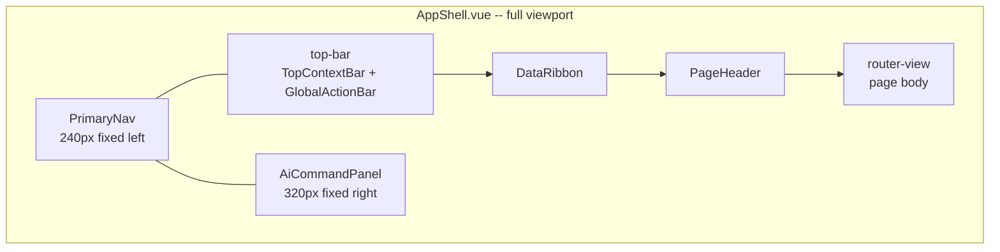
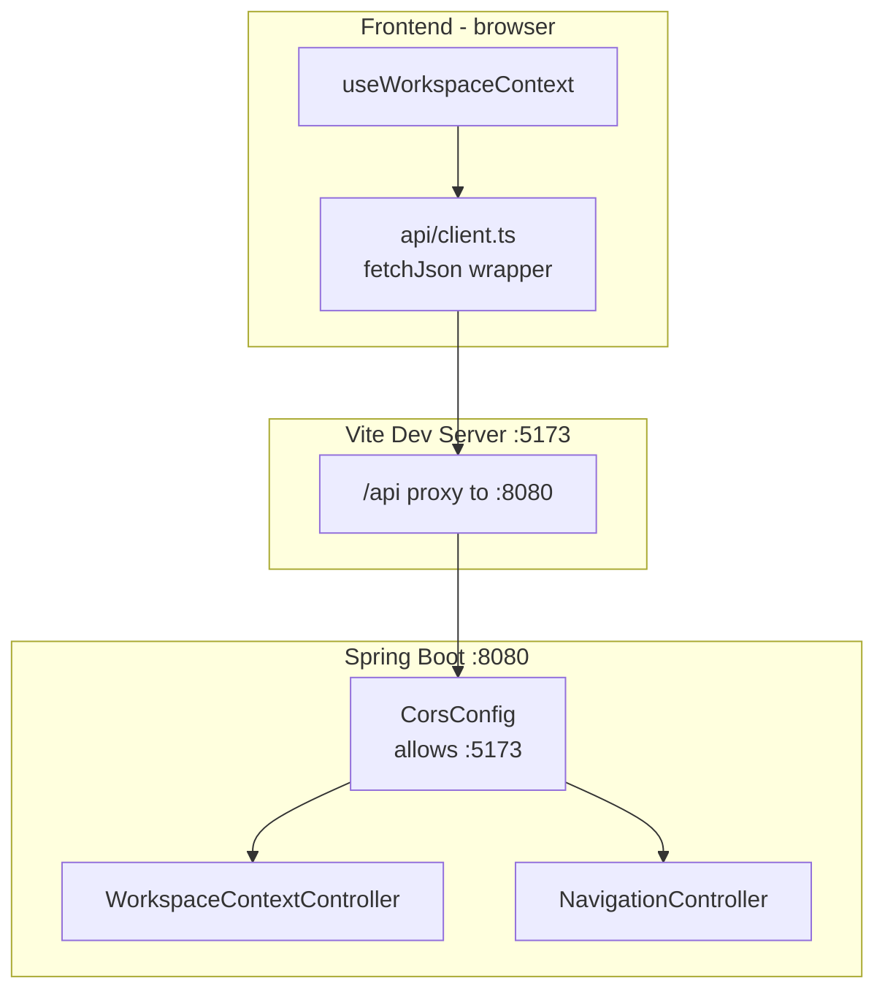

# Shared App Shell Design

## Purpose

This document defines the concrete component APIs, file structure, data model,
visual design decisions, and API contracts for the shared app shell. It bridges
the [architecture](../04-architecture/shared-app-shell-architecture.md) and the
[implementation tasks](../06-tasks/shared-app-shell-tasks.md).

## Traceability

- Stories: [shared-app-shell-stories.md](../02-user-stories/shared-app-shell-stories.md)
- Spec: [shared-app-shell-spec.md](../03-spec/shared-app-shell-spec.md)
- Architecture: [shared-app-shell-architecture.md](../04-architecture/shared-app-shell-architecture.md)
- Visual design system: [design.md](../../design.md) (root — "Tactical Command")
- Product design: [design.md](design.md) (Module Design, Component Seed)

## 1. File Structure

```
frontend/src/
├── api/
│   └── client.ts                    # fetch wrapper for /api/v1/*
├── assets/styles/
│   ├── variables.css                # design tokens (colors, typography, spacing)
│   └── main.css                     # global styles, utilities, animations
├── components/
│   ├── AppShell.vue                 # root layout frame
│   ├── PrimaryNav.vue               # 240px left nav rail
│   ├── TopContextBar.vue            # workspace context chain
│   ├── GlobalActionBar.vue          # search, notifications, audit, theme toggle
│   ├── PageHeader.vue               # page title, subtitle, action buttons
│   ├── AiCommandPanel.vue           # 320px right AI panel
│   └── shared/
│       └── DataRibbon.vue           # operational metadata strip
├── composables/
│   ├── useWorkspaceContext.ts       # singleton — fetches from API
│   └── useTheme.ts                  # dark/light toggle with localStorage
├── router/
│   └── index.ts                     # 13 routes with ShellPageConfig metadata
├── types/
│   └── shell.ts                     # WorkspaceContext, ShellPageConfig, NavItem
└── views/
    ├── DashboardView.vue            # Round 1 page
    ├── ProjectSpaceView.vue         # Round 1 page
    ├── IncidentManagementView.vue   # Round 1 page
    ├── PlatformCenterView.vue       # Round 1 page
    └── PlaceholderView.vue          # shared "Coming Soon" for 9 deferred routes
```

## 2. Layout Composition



**Layout rules:**

| Region | Width | Height | Behavior |
|--------|-------|--------|----------|
| PrimaryNav | 240px fixed | 100vh | Scrolls independently |
| Top Bar | fills remaining | 48px | Fixed at top |
| DataRibbon | fills remaining | auto (~24px) | Fixed below top bar |
| Content | fills remaining | fills remaining | Scrolls vertically |
| AiCommandPanel | 320px fixed | 100vh | Scrolls independently |

## 3. Component API Contracts

### AppShell.vue

No props. Composes all shell regions and hosts `<router-view />`.

### PrimaryNav.vue

| Input | Source | Description |
|-------|--------|-------------|
| `NAVIGATION_ITEMS` | imported from `router/index.ts` | 13 nav entries |
| `route.meta.navKey` | Vue Router | drives active indicator |

Renders 13 items with left-edge active indicator. Items marked `comingSoon`
render dimmed. Footer shows system status LED.

### TopContextBar.vue

| Input | Source | Description |
|-------|--------|-------------|
| `context` | `useWorkspaceContext()` | reactive WorkspaceContext |
| `loading` | `useWorkspaceContext()` | boolean loading state |
| `error` | `useWorkspaceContext()` | nullable error message |

Displays 5-field context chain: Workspace → Application → Group → Project → Environment.
Missing optional fields render as `---`. Shows loading text or error with retry button.

### GlobalActionBar.vue

| Input | Source | Description |
|-------|--------|-------------|
| `theme` | `useTheme()` | current theme |
| `toggleTheme` | `useTheme()` | toggle function |

Renders theme toggle + search, notifications, audit icon buttons.

### PageHeader.vue

| Input | Source | Description |
|-------|--------|-------------|
| `route.meta.title` | Vue Router | page title string |
| `route.meta.subtitle` | Vue Router | optional subtitle |
| `route.meta.actions` | Vue Router | optional action buttons |

Reads `ShellPageConfig` from route metadata. Falls back to `"{navKey} OPERATIONAL VIEW"`
when no subtitle provided. Renders action buttons dynamically from the `actions` array.

### AiCommandPanel.vue

Route-controlled 320px right rail. The shell renders it when `ShellPageConfig.showAiPanel`
is not `false`; pages that keep evidence and execution status in their main content area
can suppress the rail.

The component accepts page-scoped content from `shellUiStore.setAiPanelContent(...)` and
supports four zones:

| Zone | Purpose |
|------|---------|
| Summary | Current operational context summary |
| Reasoning | AI verification / reasoning bullets with LED indicators |
| Evidence | JSON or technical output in monospace |
| Command Input | Text input for AI commands (`/ for skills`) |

### DataRibbon.vue

Horizontal metadata strip using `label-sm` JetBrains Mono, pipe-separated.
Signature "Tactical Command" component from the visual design system.

## 4. Data Model

### WorkspaceContext

Frontend type (spec §4.3):

```typescript
interface WorkspaceContext {
  workspace: string;
  application: string;
  snowGroup?: string | null;
  project?: string | null;
  environment?: string | null;
}
```

Backend JPA entity (`workspace_context` table):

| Column | Type | Nullable | Maps to |
|--------|------|----------|---------|
| `id` | BIGINT (identity) | No | hidden from API |
| `workspace_name` | VARCHAR(255) | No | `workspace` |
| `application_name` | VARCHAR(255) | No | `application` |
| `snow_group` | VARCHAR(255) | Yes | `snowGroup` |
| `project_name` | VARCHAR(255) | Yes | `project` |
| `environment_name` | VARCHAR(255) | Yes | `environment` |

### ShellPageConfig

```typescript
interface ShellPageConfig {
  navKey: string;
  title: string;
  subtitle?: string;
  actions?: Array<{ key: string; label: string }>;
}
```

Delivered via Vue Router route metadata. Each Round 1 page defines its own config
in `router/index.ts` via the `PAGE_CONFIGS` map.

### NavItem

Frontend type:

```typescript
interface NavItem {
  key: string;
  label: string;
  path: string;
  comingSoon?: boolean;
}
```

Backend record (includes additional fields for future dynamic nav):

```java
record NavItem(String key, String label, String path,
               boolean comingSoon, String icon, int order)
```

## 5. API Contracts

### GET /api/v1/workspace-context

Returns the current workspace context for display in the top context bar.

```json
{
  "workspace": "Global SDLC Tower",
  "application": "Payment-Gateway-Pro",
  "snowGroup": "FIN-TECH-OPS",
  "project": "Q2-Cloud-Migration",
  "environment": "Production"
}
```

- `id` field is excluded from JSON via `@JsonIgnore`
- `snowGroup`, `project`, `environment` may be `null`
- Returns `404` if no workspace context is seeded

### GET /api/v1/nav/entries

Returns the ordered list of 13 navigation items.

```json
[
  { "key": "dashboard", "label": "Dashboard", "path": "/", "comingSoon": false, "icon": "LayoutDashboard", "order": 1 },
  { "key": "team", "label": "Team Space", "path": "/team", "comingSoon": true, "icon": "Users", "order": 2 },
  ...
]
```

- Static in V1 (no database table — hardcoded in `NavigationService`)
- `icon` values match Lucide icon component names
- `order` provides explicit sort position for future dynamic ordering

### GET /actuator/health

Standard Spring Boot health endpoint. Returns `200 OK` with `{"status": "UP"}`.

## 6. Visual Design Decisions

The shell implements the "Tactical Command" design system from
[design.md](../../design.md). Key decisions for this slice:

### Surface Hierarchy (No-Line Rule)

Layout sectioning uses tonal background shifts, not borders:

| CSS Class | Token | Usage |
|-----------|-------|-------|
| `section-low` | `--color-surface-container-low` (#131b2e) | Nav, top bar |
| `section-high` | `--color-surface-container-high` (#222a3d) | Cards, interactive modules |
| `section-highest` | `--color-surface-container-highest` (#2d3449) | Emphasis, input areas |

Exception: Ghost borders (`1px solid rgba(69, 70, 77, 0.2)`) are used where
containment is functionally required (top bar bottom edge, nav footer, AI panel left edge).

### Glassmorphism

Applied via `.glass-panel` utility class on the top bar and context bar:

- `backdrop-filter: blur(20px)`
- Semi-transparent background at 60% opacity
- Creates depth perception per design system §2 "Glass & Gradient Rule"

### Typography

| Role | Font | Size | Weight | Tracking |
|------|------|------|--------|----------|
| Page title | Inter | 1.75rem | 700 | -0.02em |
| HUD labels | Inter | 0.625–0.75rem | 500–600 | 0.05em uppercase |
| Technical values | JetBrains Mono | 0.75rem | 400 | normal |
| Body | Inter | 0.8125rem | 400 | normal |

### Status LEDs

6px circular indicators with 2px outer diffusion glow:

| State | Token | Hex |
|-------|-------|-----|
| Health / OK | `--color-health-emerald` | #4edea3 |
| Incident / Error | `--color-incident-crimson` | #ffb4ab |
| Approval / Warning | `--color-approval-amber` | #f59e0b |

### Buttons

| Type | Background | Text | Special |
|------|-----------|------|---------|
| Primary (Machined) | `--color-primary` | `--color-on-primary` | — |
| AI Action | gradient(135°, secondary → on-secondary-container) | white | outer glow |

### Theme Support

Dark theme is the default "Tactical Command" mode. Light theme is provided as an
accessibility option. Theme preference is persisted in `localStorage` under key
`sdlc-tower-theme` and applied via `data-theme` attribute on `<html>`.

### Animations

| Animation | Usage | Duration |
|-----------|-------|----------|
| `animate-fade-in` | Content area entrance, context chain items | 0.4s ease-out |
| `led-pulse` | System status LED in nav footer | 2s infinite |
| Hover transitions | Nav items, buttons, icon buttons | 0.2s |
| Theme toggle | Slider thumb position, icon colors | 0.3s |

## 7. Database Schema

Managed by Flyway migrations (not JPA auto-DDL):

```sql
-- V1__create_workspace_context.sql
CREATE TABLE workspace_context (
    id                BIGINT GENERATED BY DEFAULT AS IDENTITY PRIMARY KEY,
    workspace_name    VARCHAR(255) NOT NULL,
    application_name  VARCHAR(255) NOT NULL,
    snow_group        VARCHAR(255),
    project_name      VARCHAR(255),
    environment_name  VARCHAR(255)
);

-- V2__seed_workspace_context.sql
INSERT INTO workspace_context (workspace_name, application_name, snow_group, project_name, environment_name)
VALUES ('Global SDLC Tower', 'Payment-Gateway-Pro', 'FIN-TECH-OPS', 'Q2-Cloud-Migration', 'Production');
```

## 8. Error and Empty State Design

| Scenario | Behavior |
|----------|----------|
| Context API loading | TopContextBar shows "Loading workspace context..." |
| Context API error | TopContextBar shows "Context unavailable" + retry button |
| Optional context field is null | Renders `---` placeholder |
| Page view error | Shell frame remains; only page content area is affected |
| AI panel has no content | Static placeholder zones render |
| Coming Soon route | PlaceholderView with amber "Coming Soon" tag |

## 9. Integration Boundary



- Frontend fetches via relative `/api/v1/*` paths
- Vite proxy forwards to Spring Boot during development
- CORS allows `http://localhost:5173` for direct API calls
- Production deployment will use a reverse proxy (no CORS needed)

## 10. Open Design Questions

- Should DataRibbon content be static or driven by API in future slices?
- Should the AI Command Panel support a collapsed/minimized state on smaller desktops?
- Should page-specific actions in PageHeader trigger API calls or emit events for parent handling?
- What is the content delivery contract for page-scoped AI panel content?
