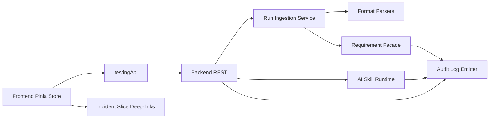

# Testing Management — Design

## 1. Purpose

This is the concrete implementation-facing design for the Testing Management slice. It pins down file structure, component API contracts, Pinia store shape, visual decisions, empty/error states, routing wiring, and the integration boundary. It operationalizes the upstream 8 docs.

### Upstream references

- Requirements: [../01-requirements/testing-management-requirements.md](../01-requirements/testing-management-requirements.md)
- Stories: [../02-user-stories/testing-management-stories.md](../02-user-stories/testing-management-stories.md)
- Spec: [../03-spec/testing-management-spec.md](../03-spec/testing-management-spec.md)
- Architecture: [../04-architecture/testing-management-architecture.md](../04-architecture/testing-management-architecture.md)
- Data flow: [../04-architecture/testing-management-data-flow.md](../04-architecture/testing-management-data-flow.md)
- Data model: [../04-architecture/testing-management-data-model.md](../04-architecture/testing-management-data-model.md)
- API guide: [contracts/testing-management-API_IMPLEMENTATION_GUIDE.md](contracts/testing-management-API_IMPLEMENTATION_GUIDE.md)

## 2. File Structure

### Frontend

```
frontend/src/modules/testing/
├── api/
│   └── testingApi.ts
├── stores/
│   └── testingStore.ts
├── types/
│   ├── enums.ts
│   ├── catalog.ts
│   ├── plan.ts
│   ├── case.ts
│   ├── run.ts
│   ├── coverage.ts
│   └── ai.ts
├── mock/
│   ├── catalog.mock.ts
│   ├── planDetail.mock.ts
│   ├── caseDetail.mock.ts
│   ├── runDetail.mock.ts
│   ├── traceability.mock.ts
│   └── commandLoop.ts
├── components/
│   ├── primitives/
│   │   ├── CoverageLed.vue
│   │   ├── TestTypeChip.vue
│   │   ├── PriorityChip.vue
│   │   ├── CaseStateBadge.vue
│   │   ├── RunStatusBadge.vue
│   │   ├── ReqChip.vue
│   │   ├── IncidentChip.vue
│   │   ├── RunDurationPill.vue
│   │   ├── AiDraftStatusBanner.vue
│   │   ├── RedactedFailureExcerpt.vue
│   │   └── AiDraftQuotaBanner.vue
│   ├── catalog/
│   │   ├── CatalogSummaryBarCard.vue
│   │   ├── CatalogGridCard.vue
│   │   ├── CatalogFilterBar.vue
│   │   └── CatalogAiInsightsCard.vue
│   ├── plan/
│   │   ├── PlanHeaderCard.vue
│   │   ├── PlanCasesCard.vue
│   │   ├── PlanCoverageCard.vue
│   │   ├── PlanRecentRunsCard.vue
│   │   ├── PlanAiDraftInboxCard.vue
│   │   └── PlanAiInsightsCard.vue
│   ├── case/
│   │   ├── CaseHeaderCard.vue
│   │   ├── CaseBodyCard.vue
│   │   ├── CaseLinksCard.vue
│   │   ├── CaseRunHistoryCard.vue
│   │   └── CaseRevisionDrawer.vue
│   ├── run/
│   │   ├── RunHeaderCard.vue
│   │   ├── RunOutcomesCard.vue
│   │   ├── RunEnvironmentCard.vue
│   │   ├── RunCoverageRollupCard.vue
│   │   └── OpenIncidentAction.vue
│   └── traceability/
│       ├── TraceabilityInputCard.vue
│       ├── TraceabilityCasesCard.vue
│       └── TraceabilityAggregateCard.vue
└── views/
    ├── CatalogView.vue
    ├── PlanDetailView.vue
    ├── CaseDetailView.vue
    ├── RunDetailView.vue
    └── TraceabilityView.vue
```

### Backend

```
backend/src/main/java/com/sdlctower/domain/testing/
├── controller/
│   ├── TestingCatalogController.java
│   ├── TestingPlanController.java
│   ├── TestingCaseController.java
│   ├── TestingRunController.java
│   ├── TestingTraceabilityController.java
│   ├── TestingRunIngestionController.java
│   └── TestingAiController.java
├── service/
│   ├── CatalogService.java
│   ├── PlanDetailService.java
│   ├── CaseDetailService.java
│   ├── RunDetailService.java
│   ├── TraceabilityService.java
│   ├── AiDraftService.java
│   ├── AiInsightsService.java
│   ├── RunIngestionService.java
│   └── EnvironmentService.java
├── ingestion/
│   ├── RunParserDispatcher.java
│   ├── JunitXmlParser.java
│   ├── TestngXmlParser.java
│   ├── PlaywrightJsonParser.java
│   ├── CypressMochawesomeParser.java
│   ├── FailureRedactor.java
│   ├── ExternalRunIdValidator.java
│   └── IngestionAuditLogger.java
├── projection/
│   ├── CatalogSummaryProjection.java
│   ├── CatalogGridProjection.java
│   ├── PlanHeaderProjection.java
│   ├── PlanCasesProjection.java
│   ├── PlanCoverageProjection.java
│   ├── PlanRecentRunsProjection.java
│   ├── PlanAiDraftInboxProjection.java
│   ├── PlanAiInsightsProjection.java
│   ├── CaseHeaderProjection.java
│   ├── CaseBodyProjection.java
│   ├── CaseLinksProjection.java
│   ├── CaseRunHistoryProjection.java
│   ├── RunHeaderProjection.java
│   ├── RunOutcomesProjection.java
│   ├── RunEnvironmentProjection.java
│   ├── RunCoverageRollupProjection.java
│   ├── TraceabilityProjection.java
│   └── CoverageStatsProjection.java
├── policy/
│   ├── TestingAccessGuard.java
│   ├── AiAutonomyPolicy.java
│   ├── ReqLinkResolver.java
│   ├── CoverageCalculator.java
│   └── SecretRedactor.java
├── integration/
│   ├── RequirementFacade.java
│   ├── IncidentFacade.java
│   ├── AiSkillClient.java
│   └── EnvironmentRegistry.java
├── persistence/
│   ├── entity/ ... (V60–V67 entities)
│   ├── repository/ ...
│   └── converter/ ...
├── dto/
│   └── ... (all records from data model §4)
└── events/
    └── TestingChangeLogPublisher.java

backend/src/main/resources/db/migration/
├── V60__create_test_plan.sql
├── V61__create_test_case.sql
├── V62__create_test_case_req_link.sql
├── V63__create_test_run.sql
├── V64__create_test_case_outcome.sql
├── V65__create_environment_registry.sql
├── V66__create_ai_draft_and_audit.sql
├── V67__seed_testing_local.sql
```

## 3. Visual Layout

### 3.1 Catalog (`/testing`)

12-column grid:

- Row 1 (cols 1–12): `CatalogSummaryBarCard` (aggregate: plan count, active cases, 7d runs, overall pass rate, mean duration)
- Row 2 (cols 1–12): `CatalogFilterBar` (project, plan state, coverage LED, release target, search)
- Row 3 (cols 1–9): `CatalogGridCard` (plan tiles by project, with lineage badge)
- Row 3 (cols 10–12): `CatalogAiInsightsCard` (workspace-level AI draft quota, disabled/observation notice)

Breakpoints: ≥1280 as above; 1024–1279: Summary/Filter full-width, Grid above Insights (stacked); <1024: vertical stack.

### 3.2 Plan Detail (`/testing/plans/:planId`)

- Row 1 (cols 1–12): `PlanHeaderCard` (name, description, state, owner, release, project, created/updated)
- Row 2 (cols 1–8): `PlanCasesCard`, (cols 9–12): `PlanCoverageCard`
- Row 3 (cols 1–12): `PlanRecentRunsCard` (up to 20 runs; trigger source, environment, pass/fail/skip counts)
- Row 4 (cols 1–12): `PlanAiDraftInboxCard` (pending DRAFT cases with approve/reject/edit affordances)
- Row 5 (cols 1–12): `PlanAiInsightsCard` (7-day narrative: what changed, trending failures, lost coverage)

### 3.3 Case Detail (`/testing/cases/:caseId`)

- Row 1 (cols 1–12): `CaseHeaderCard` (title, type, priority, state, owner, linked-REQ chips, linked-incident chips)
- Row 2 (cols 1–12): `CaseBodyCard` (preconditions, steps, expected — all sanitized markdown)
- Row 3 (cols 1–12): `CaseLinksCard` (REQ-ID chips with VERIFIED/UNVERIFIED/UNKNOWN_REQ status; incident deep-links)
- Row 4 (cols 1–12): `CaseRunHistoryCard` (sparkline + last 20 outcomes per plan; click row → Run Detail)

### 3.4 Run Detail (`/testing/runs/:runId`)

- Row 1 (cols 1–12): `RunHeaderCard` (plan, environment, trigger, actor, duration, start/end)
- Row 2 (cols 1–8): `RunOutcomesCard` (per-case outcomes with failure excerpts), (cols 9–12): `RunEnvironmentCard` (env metadata, no credentials)
- Row 3 (cols 1–12): `RunCoverageRollupCard` ("Stories covered by this run": union of all ACTIVE case REQ-IDs; capped at 200)
- Row 4 (cols 1–12): `OpenIncidentAction` (one-click "Open Incident from this failure" for each failed case; context pre-filled)

### 3.5 Traceability (`/testing/traceability`)

- Row 1: `TraceabilityInputCard` (REQ-ID input with typeahead)
- Row 2: `TraceabilityCasesCard` (all ACTIVE test cases linked to REQ, grouped by plan, with most-recent run status)
- Row 3: `TraceabilityAggregateCard` (coverage status badge: GREEN/AMBER/RED/GREY; last-run history)

## 4. Visual Tokens

Reuses shared Tactical Command tokens. New tokens added only if absent from design.md:

- `--color-status-green` (coverage ≥80%), `--color-status-amber` (50–79%), `--color-status-red` (<50%), `--color-status-grey` (no linked REQs)
- `--color-test-type-functional`, `--color-test-type-regression`, `--color-test-type-smoke`, `--color-test-type-perf`, `--color-test-type-security`
- `--color-priority-p0`, `--color-priority-p1`, `--color-priority-p2`, `--color-priority-p3`
- `--color-draft-badge-bg`, `--color-deprecated-badge-bg`, `--color-stale-badge-bg`
- Monospace: `JetBrains Mono` for run IDs, timestamps, external run IDs
- Sans: `Inter` for everything else

Coverage LEDs use shape + text redundancy per REQ-TM-90 (a11y). All chips carry ARIA labels.

## 5. Component API Contracts

### 5.1 Primitives

| Component | Props | Emits | Notes |
| --------- | ----- | ----- | ----- |
| `CoverageLed` | `coverage: 'GREEN'\|'AMBER'\|'RED'\|'GREY'`, `size?: 'sm'\|'md'\|'lg'` | — | Shape + color + text label (e.g., "≥80%") |
| `TestTypeChip` | `type: TestType` | — | FUNCTIONAL/REGRESSION/SMOKE/PERF/SECURITY |
| `PriorityChip` | `priority: Priority` | — | P0/P1/P2/P3 with color coding |
| `CaseStateBadge` | `state: CaseState`, `origin?: 'AI_DRAFT'` | — | ACTIVE/DRAFT/DEPRECATED; DRAFT badge if AI-originated |
| `RunStatusBadge` | `status: RunStatus`, `compact?: boolean` | — | RUNNING/PASSED/FAILED/ABORTED/INGEST_FAILED |
| `ReqChip` | `chip: ReqChip`, `clickable?: boolean` | `click(reqId)` | VERIFIED=green, UNVERIFIED=amber, UNKNOWN_REQ=grey |
| `IncidentChip` | `incidentId: string`, `title: string` | `click(incidentId)` | Deep-link to Incident slice |
| `RunDurationPill` | `seconds?: number` | — | Renders `—` when null |
| `AiDraftStatusBanner` | `status: AiDraftStatus`, `skillVersion?: string`, `sourceReqExcerpt?: string`, `onApprove?: () => void`, `onReject?: () => void`, `canApprove: boolean` | `approve`, `reject`, `edit` | PENDING/APPROVED/REJECTED/STALE variants; shows source REQ text for verification |
| `RedactedFailureExcerpt` | `text: string`, `bytes: number` | — | Monospace block; redacted AWS/GH/Bearer tokens; capped at 4 KB per case |
| `AiDraftQuotaBanner` | `workspaceId: string`, `remaining: number`, `limit: number` | `dismiss` | Sticky top-of-card; shows "X drafts remaining of Y per day" |

### 5.2 Catalog Cards

| Card | Input | Source | Notes |
| ---- | ----- | ------ | ----- |
| `CatalogSummaryBarCard` | — | `testingStore.catalog.summary` | Skeleton on PENDING; per-card error + retry |
| `CatalogGridCard` | — | `testingStore.catalog.grid` | Tiles group by project; sticky project header; lineage badge |
| `CatalogFilterBar` | `v-model:filters` | local state bound to store | Emits `change` debounced 250ms |
| `CatalogAiInsightsCard` | — | `testingStore.catalog.aiInsights` | Workspace AI quota, autonomy-level notice |

### 5.3 Plan Cards

| Card | Input | Source |
| ---- | ----- | ------ |
| `PlanHeaderCard` | `planId` | `planDetail.header` |
| `PlanCasesCard` | — | `planDetail.cases` |
| `PlanCoverageCard` | — | `planDetail.coverage` |
| `PlanRecentRunsCard` | — | `planDetail.recentRuns` |
| `PlanAiDraftInboxCard` | — | `planDetail.aiDraftInbox` |
| `PlanAiInsightsCard` | — | `planDetail.aiInsights` |

### 5.4 Case Cards

| Card | Input | Source |
| ---- | ----- | ------ |
| `CaseHeaderCard` | `caseId` | `caseDetail.header` |
| `CaseBodyCard` | — | `caseDetail.body` |
| `CaseLinksCard` | — | `caseDetail.links` |
| `CaseRunHistoryCard` | — | `caseDetail.runHistory` |
| `CaseRevisionDrawer` | `caseId` | `caseDetail.revisions` (side drawer; opened via header action) |

### 5.5 Run Cards

| Card | Input | Source |
| ---- | ----- | ------ |
| `RunHeaderCard` | `runId` | `runDetail.header` |
| `RunOutcomesCard` | — | `runDetail.outcomes` |
| `RunEnvironmentCard` | — | `runDetail.environment` |
| `RunCoverageRollupCard` | — | `runDetail.coverageRollup` |
| `OpenIncidentAction` | `context: OpenIncidentContext` | `runDetail.openIncidentContext` | Renders disabled with tooltip when principal lacks incident-create (REQ-TM-31) |

### 5.6 Traceability Cards

| Card | Input | Source |
| ---- | ----- | ------ |
| `TraceabilityInputCard` | `v-model:reqId` | route query | Typeahead against recent verified REQ-IDs |
| `TraceabilityCasesCard` | — | `traceability.cases` |
| `TraceabilityAggregateCard` | — | `traceability.aggregate` |

## 6. Pinia Store Shape

```ts
interface TestingManagementState {
  catalog: CatalogAggregate | null;
  planDetail: PlanDetailAggregate | null;
  caseDetail: CaseDetailAggregate | null;
  runDetail: RunDetailAggregate | null;
  traceability: TraceabilityAggregate | null;
  filters: CatalogFilters;
  activeIds: {
    planId: string | null;
    caseId: string | null;
    runId: string | null;
    reqId: string | null;
  };
  loading: Record<CardKey, boolean>;
  errors: Record<CardKey, { code: string; message: string } | null>;
  pollHandles: Record<string, number>; // for PENDING AI draft rows
  principal: {
    canCreateIncident: boolean;
    canApproveDrafts: boolean;     // QA Lead or Tech Lead
    canCreatePlans: boolean;       // QA Lead, Tech Lead, PM
    workspaceAutonomy: 'DISABLED' | 'OBSERVATION' | 'SUPERVISED' | 'AUTONOMOUS';
    isAdmin: boolean;
  };
  aiDraftQuota: {
    remaining: number;
    limit: number;
    resetAt: string; // ISO timestamp for next day
  };
}
```

Actions:

- `initCatalog(filters?)`, `refreshCatalogCard(cardKey)`
- `openPlan(planId)`, `refreshPlanCard(cardKey)`, `closePlan()`
- `openCase(caseId)`, `updateCaseRevision(caseId, fieldDiffs)`, `closeCase()`
- `openRun(runId)`, `openIncidentPreFill(runId, caseId, failureExcerpt)`, `closeRun()`
- `lookupReq(reqId)`, `refreshTraceabilityCard(cardKey)`
- `draftAiTestCases(planId, reqId)` — returns list of DRAFT cases; emits rate-limit banner on 429
- `approveDraftCase(caseId)`, `rejectDraftCase(caseId)`, `editThenApproveDraftCase(caseId, edits)`
- `startAiDraftPolling(planId)`, `stopAiDraftPolling(planId)` — 3s → 10s backoff
- `reset()` on unmount of root views

## 7. Routing and Navigation

`router.ts` entries (order matters — traceability before wildcard plans):

```ts
{ path: '/testing', component: CatalogView, meta: { breadcrumb: 'Testing' } },
{ path: '/testing/traceability', component: TraceabilityView, meta: { breadcrumb: 'Testing / Traceability' } },
{ path: '/testing/plans/:planId', component: PlanDetailView, props: true },
{ path: '/testing/cases/:caseId', component: CaseDetailView, props: true },
{ path: '/testing/runs/:runId', component: RunDetailView, props: true },
```

All routes guarded by `requireWorkspaceMember(resolveWorkspaceId(to))`. Deep-link contract: every identity addressable by URL alone.

Shell nav config: remove `comingSoon` for Testing.

## 8. Empty / Error / Loading States (canonical copies per REQ-TM-71)

- "No test plans yet in this workspace — create your first plan from [Plan CRUD form]."
- "No test cases in this plan yet."
- "No test runs yet for this plan — waiting for the first ingestion."
- "No AI drafts pending — all AI drafts in this plan have been reviewed."
- "AI drafts are disabled for this workspace (autonomy=DISABLED)."
- "AI draft generation failed; admin can retry with updated skill."
- "AI draft stale — new skill version available; re-draft available for QA Lead."
- "No linked requirements found for this test case."
- "Run parse failed — [first 2 KB of parser error]; admin may re-upload after fixing."
- "Story not found or not visible in this workspace."
- "Some data may be stale due to incomplete REQ resolution — next retry at [time]."
- "Run ingestion conflict: externalRunId already exists; force=true required (admin only)."

Loading = skeleton rows, one per expected card. Error = message + Retry button. Per-card isolation strictly enforced (REQ-TM-70).

## 9. Phase A / Phase B Toggle

```ts
const USE_BACKEND = import.meta.env.VITE_USE_BACKEND === 'true';
export const testingApi = USE_BACKEND ? liveClient : mockClient;
```

Mock `commandLoop.ts` simulates all documented error codes (403, 404, 409, 429), AI draft states (PENDING, APPROVED, REJECTED, STALE), REQ resolution states (VERIFIED, UNVERIFIED, UNKNOWN_REQ), and run ingestion parse failures. Phase A latencies are within per-projection budgets (REQ-TM-92: Catalog P95 1200ms, Plan P95 1500ms, Run P95 1500ms per-projection timeout 500ms).

## 10. Data Model Summary

### Frontend Types (TypeScript)

```ts
type TestType = 'FUNCTIONAL' | 'REGRESSION' | 'SMOKE' | 'PERF' | 'SECURITY';
type Priority = 'P0' | 'P1' | 'P2' | 'P3';
type CaseState = 'DRAFT' | 'ACTIVE' | 'DEPRECATED';
type RunStatus = 'RUNNING' | 'PASSED' | 'FAILED' | 'ABORTED' | 'INGEST_FAILED';
type CaseOutcome = 'PASS' | 'FAIL' | 'SKIP' | 'ERROR';
type ReqLinkStatus = 'VERIFIED' | 'UNVERIFIED' | 'UNKNOWN_REQ';
type EnvironmentKind = 'DEV' | 'STAGING' | 'PROD' | 'EPHEMERAL' | 'OTHER';
type PlanState = 'DRAFT' | 'ACTIVE' | 'ARCHIVED';
type CoverageStatus = 'GREEN' | 'AMBER' | 'RED' | 'GREY'; // derived from run outcomes
type AiDraftStatus = 'PENDING' | 'APPROVED' | 'REJECTED' | 'STALE';
```

### Backend Entities (JPA, mapped in data-model.md)

- `TestPlan` (V60)
- `TestCase` (V61)
- `TestCaseReqLink` (V62)
- `TestRun` (V63)
- `TestCaseOutcome` (V64)
- `Environment` (V65)
- `AiTestCaseDraft` (V66) with `AiDraftAuditLog`

## 11. API Contracts (summary)

**Catalog:**
- `GET /api/v1/testing/catalog` → `CatalogAggregate` (summary, grid, aiSummary, filters applied)

**Plans:**
- `GET /api/v1/testing/plans/:planId` → `PlanDetailAggregate` (6 cards)
- `POST /api/v1/testing/plans` → `TestPlan` (CRUD)
- `PATCH /api/v1/testing/plans/:planId` → `TestPlan`

**Cases:**
- `GET /api/v1/testing/cases/:caseId` → `CaseDetailAggregate` (4 cards)
- `POST /api/v1/testing/plans/:planId/cases` → `TestCase` (CRUD)
- `PATCH /api/v1/testing/cases/:caseId` → `TestCase` (captures revision)

**Runs:**
- `GET /api/v1/testing/runs/:runId` → `RunDetailAggregate` (4 cards)
- `POST /api/v1/testing/runs/ingest` (multipart: file + planId + environment) → `TestRun` (parse + persist)
- `POST /api/v1/testing/runs/webhook` (signed with HMAC-SHA256) → `TestRun` (REQ-TM-85)

**AI:**
- `POST /api/v1/testing/ai/test-cases/draft` (reqId, planId) → `List<AiTestCaseDraft>` (rate-limited; REQ-TM-58)
- `PATCH /api/v1/testing/ai/drafts/:draftId/approve` → `TestCase` (state=ACTIVE)
- `PATCH /api/v1/testing/ai/drafts/:draftId/reject` → `TestCase` (state=DEPRECATED)

**Traceability:**
- `GET /api/v1/testing/traceability/req/:reqId` → `TraceabilityAggregate` (cases, plans, coverage)

Full endpoint contracts with JSON examples in `contracts/testing-management-API_IMPLEMENTATION_GUIDE.md`.

## 12. Error and Empty State Design

### Empty States (with wireframe guidance)

- **Catalog, no plans:** Icon + heading "No test plans yet" + link "Create plan" → opens Plan CRUD form modal
- **Plan, no cases:** Icon + "No test cases in this plan" + link "Add case" → Case CRUD form modal
- **Plan, no runs:** Icon + "Waiting for first test run" + copy "Upload results from your CI or QA tooling"
- **Plan, no AI drafts pending:** Icon + "All drafts reviewed" (not an error, just informational)
- **Plan, AI drafts disabled:** Icon + warning color + "AI drafts disabled (autonomy=DISABLED)" + link to Platform Center
- **Run parse failed (REQ-TM-74):** Error color icon + heading "Parse error" + first 2 KB of parser output in monospace + Retry button

### Error Render (per-card section, REQ-TM-70)

```vue
<template>
  <card v-if="error">
    <div class="error-state">
      <ErrorIcon class="error-icon" />
      <h3>{{ error.message }}</h3>
      <button @click="onRetry">Retry</button>
    </div>
  </card>
  <card v-else-if="loading">
    <SkeletonRows :count="expectedRowCount" />
  </card>
  <card v-else>
    <!-- content -->
  </card>
</template>
```

Per-card error never wipes out the page. Retry action re-fetches that card's data in isolation.

## 13. Integration Boundary



The Control Tower never triggers external CI runners. The `RunIngest` arrow accepts files (manual upload or signed webhook per REQ-TM-85). The `FE --> Inc` arrow is a navigation: it deep-links to Incident slice with pre-filled context (plan ID, case ID, run ID, environment, failure excerpt redacted per REQ-TM-80).

## 14. Testing Strategy

### Frontend

- Unit (Vitest): primitives, store actions, AI draft polling, coverage status derivation, REQ-ID chip status logic
- Component (@vue/test-utils): each card's states (loading/success/error/empty/stale), AI draft approval/rejection flow, draft quota banner, per-card error + retry isolation
- E2E (Playwright, Phase B only): Catalog → Plan → Case drill, Traceability reverse lookup, failed-run → Open Incident deep-link pre-fill, AI draft approval workflow

### Backend

- Controller (MockMvc): every endpoint happy + 403/404/409/429 paths; per-projection timeout isolation; webhook signature rejection + accept paths
- Service: each projection with H2; each AI service with fake skill client; run ingestion parse error handling (all 4 formats); evidence-integrity check (e.g., failure-excerpt redaction)
- Policy: access guard (workspace, project role), AI autonomy gating, REQ-ID resolution (positive/negative/multi), secret redaction (AWS/GH/Bearer patterns per REQ-TM-80)
- Ingestion: JUnit/TestNG/Playwright/Cypress format parsers; externalRunId deduplication + conflict handling; INGEST_FAILED state capture
- Flyway: V60–V67 apply cleanly on H2; check constraints enforced
- Golden-file: API envelopes match API guide examples byte-for-byte

## 15. Accessibility

- All coverage LEDs carry shape + text redundancy (REQ-TM-90)
- All interactive chips have ARIA labels and keyboard focus states
- Test case lists expose linear tab order: case title → type chip → priority chip → state badge → linked-REQ → linked-incident
- Modals (e.g., Plan CRUD, Case CRUD) trap focus
- Color contrast ≥ WCAG AA on all text; "red for failure" is never color-only (always paired with icon or text)
- Failure excerpts use monospace `JetBrains Mono` for code readability

## 16. Non-Goals (Design)

- No bulk case import (single-case CRUD only)
- No case screenshot/attachment support (markdown body only per REQ-TM-36)
- No test plan approval workflow beyond ACTIVE/ARCHIVED state
- No triggering or re-running tests from the Control Tower
- No per-test-plan ACL beyond workspace membership
