# Report Center — Tasks

## Purpose

Phased implementation breakdown for the **Report Center** slice, mapped
to the SDD doc set. Frontend work is executed by **Codex** and backend
work is executed by **Codex** (per user decision 2026-04-18). Claude
Code owns SDD, review, and orchestration.

## Upstream Inputs

- [`report-center-requirements.md`](../01-requirements/report-center-requirements.md)
- [`report-center-stories.md`](../02-user-stories/report-center-stories.md)
- [`report-center-spec.md`](../03-spec/report-center-spec.md)
- [`report-center-architecture.md`](../04-architecture/report-center-architecture.md)
- [`report-center-data-flow.md`](../04-architecture/report-center-data-flow.md)
- [`report-center-data-model.md`](../04-architecture/report-center-data-model.md)
- [`report-center-design.md`](../05-design/report-center-design.md)
- [`report-center-API_IMPLEMENTATION_GUIDE.md`](../05-design/contracts/report-center-API_IMPLEMENTATION_GUIDE.md)

---

## Milestones

| Milestone | Scope | Stories |
|-----------|-------|---------|
| **M1 — Catalog + Run (MVP)** | Browsing catalog, running a report, rendering headline/chart/drilldown | RPT-S01, S02, S10, S11, S13, S20, S21, S22, S50 |
| **M2 — Filter richness + Export** | Multi-select, filter persistence, CSV + PDF export, audit | RPT-S12, S14, S30, S31, S32, S51 |
| **M3 — History** | Run history + exports history tabs | RPT-S40, S41 |

Each milestone must pass its own set of acceptance criteria and be
reviewable independently.

---

## Phase A — Frontend with Mock Data (Codex — Frontend)

### Task A1 — Scaffold feature module
- Create folder `frontend/src/features/reportcenter/` with the structure from design §2
- Create `types.ts` with all frontend types (copy from data-model §2)
- Add `useMockData` flag to the store (default `true` during Phase A)

### Task A2 — Routes and nav
- Register routes `/reports` and `/reports/:reportKey` in `frontend/src/router/index.ts`
- Add nav entry labelled `Reports` with sub-label `History`, icon `mdi-chart-timeline-variant`, ordered after `Incidents`, before `Team Space`
- Do NOT modify the shell components themselves

### Task A3 — Catalog view
- `ReportCatalogView.vue` with tabs: Catalog / History / Exports (Phase A: only Catalog renders real content)
- `ReportCategoryGroup.vue` renders one category with N `ReportCard.vue` children
- V2 categories render as disabled cards with "Coming soon"
- Mock catalog in `mockReports.ts` returns the 5 enabled reports per API guide §2

### Task A4 — Filter form
- `FilterForm.vue` composes `ScopeSelector`, `TimeRangeSelector`, `EntityMultiSelect`, `GroupingSelector`
- Validation: scopeIds non-empty, ≤ 20; custom time range start < end, ≤ 366 days
- Emits `apply` only when valid

### Task A5 — Result sections
- `HeadlineStrip.vue` — 2-4 tiles, trend arrow + color, respects `SectionResult`
- `ChartSection.vue` — routes to one of the 5 chart components based on `chartType`
- `DrilldownSection.vue` — virtualized table via `@tanstack/vue-table`
- `SectionError.vue` — inline error with Retry button
- `SectionSkeleton.vue` — shimmer per section

### Task A6 — Chart components
- 5 chart components per definitions (Histogram, StackedBar, GroupedBar, Heatmap, HorizontalBar) using ECharts 5.x + `vue-echarts`
- Shared `chartTheme.ts` using platform tokens
- Each chart accepts `{ series: SeriesPoint[] }` and converts to ECharts option

### Task A7 — Store state machine
- `runReport(key, req)` → loading → rendered | error
- Filters persist in memory during session (RPT-S14)
- URL query mirror on change (deep-linkable filters)

### Task A8 — Phase A tests
- Unit tests per design §10.1
- Snapshot tests for each chart with a canned mock
- All tests pass; `npm run build` succeeds

**Phase A Exit Criteria**

- [ ] `/reports` renders catalog with 5 Efficiency cards + 4 "Coming soon" categories
- [ ] `/reports/eff.lead-time` renders a mock report with headline, chart, drilldown
- [ ] All 5 reports each render with their respective chart type
- [ ] Filter changes re-render the report
- [ ] Section-level error simulation (flip a mock toggle) only breaks that section
- [ ] `npm run lint && npm run build` passes

---

## Phase B1 — Backend MVP (Codex — Backend)

### Task B1 — Package scaffolding
- Create package `com.sdlctower.domain.reportcenter`
- Add `ReportCenterController`, `ReportCatalogService`, `ReportRunService`, `ReportHistoryService` (stubs)
- Add `ScopeAuthGuard` — use existing `platform/workspace/WorkspaceContextService`
- Add `ApiConstants.REPORTS_BASE = "/api/v1/reports"`

### Task B2 — DTOs
- Create all DTO records per data-model §3 in `domain/reportcenter/dto/`
- Reuse `SectionResultDto<T>` pattern from dashboard; if a shared location exists use it, else duplicate (do NOT modify the dashboard class)

### Task B3 — Report definitions (code-owned registry)
- Implement `ReportDefinition` interface in `definitions/`
- Implement 5 report classes under `definitions/efficiency/`
- `ReportDefinitionRegistry` collects all via Spring DI (`@Component` + constructor list)

### Task B4 — Flyway migrations
- Next unclaimed version number (check `src/main/resources/db/migration/`)
- `V{n}__report_center_run_export.sql` — from data-model §5.1
- `V{n+1}__report_center_facts.sql` — from data-model §5.2
- `V{n+2}__report_center_seed.sql` — minimal synthetic rows for local profile
- CLAUDE.md rule 4: do NOT rely on `ddl-auto`; all DDL via Flyway

### Task B5 — Entities and repositories
- `ReportRun`, `ReportExport` entities per data-model §4
- Fact entities marked `@Immutable`
- Spring Data JPA repositories per design §3

### Task B6 — Run service implementation
- For each report definition:
  - translate `ReportRunRequest` → repository query
  - aggregate into headline + series + drilldown
  - wrap each section in `SectionResultDto`
- Stamp `snapshotAt = Instant.now()`
- Insert `report_run` row
- Measure `durationMs`; set `X-Report-Slow: true` when > 2500 ms

### Task B7 — Scope auth guard
- Resolve caller accessible scopes via `WorkspaceContextService`
- Reject with `ForbiddenException` on mismatch (maps to 403)
- Org-level requires `org-viewer` role (check via existing authz abstraction; if not present, stub via feature flag)

### Task B8 — Catalog service
- Return only reports caller can access at least one scope for
- Include V2 categories with empty `reports`

### Task B9 — History service
- Query `report_run` by user, sort DESC by `run_at`, limit 50
- Return `ReportRunHistoryEntryDto[]`

### Task B10 — Controller wiring
- Implement all endpoints per API guide §8
- Return envelope via `ApiResponse.ok(...)`
- Validation failures handled by existing `GlobalExceptionHandler`

### Task B11 — Backend tests (MVP subset)
- `ReportCenterControllerTest` covering catalog + run happy paths + 400/403/404
- `ReportRunServiceTest` for all 5 reports with seed data
- `ScopeAuthGuardTest` for org/workspace/project cases
- All existing tests still pass

### Task B12 — Frontend flip to live
- In `reportCenterStore.ts` set `useMockData = false`
- Add Vite proxy if not already covered (reuse existing `/api/v1/**`)
- Smoke test: `/reports/eff.lead-time` runs against live backend

**M1 Exit Criteria**

- [ ] `./mvnw spring-boot:run -Dspring.profiles.active=local` starts clean
- [ ] Flyway migrations applied; schemas present in H2
- [ ] `GET /api/v1/reports/catalog` returns 200 with 5 enabled reports
- [ ] `POST /api/v1/reports/eff.lead-time/run` returns 200 with 3 sections
- [ ] 403 on unauthorized scope; 400 on invalid grouping
- [ ] `./mvnw test` passes all tests
- [ ] Frontend renders against live backend end-to-end

---

## Phase B2 — Export + Audit (Codex — Backend & Frontend)

### Task B20 — Export service (backend)
- `ReportExportService.enqueue(...)` inserts `report_export` (status = `queued`) and fires `@Async` worker
- `ExportWorker` reads job, queries repository, renders CSV or PDF, writes artifact to `ArtifactStore`, updates status to `ready`
- On failure, status = `failed` with error message

### Task B21 — PDF renderer
- `PdfRenderer` using OpenHTMLtoPDF
- Template includes: title + scope + time range + generation time, headline strip (text), chart (rendered PNG via ECharts SSR or server-side stub — see note), drilldown table
- **Note:** V1 acceptable shortcut — render chart as static SVG/PNG on backend using a lightweight option: either server-side ECharts via JSR-223 + Nashorn replacement, or produce a simple canvas-rendered image via a helper utility. If infeasible in one pass, V1 may render headline + table only; chart image can be V1.5.

### Task B22 — CSV writer
- `CsvWriter` using Apache Commons CSV
- Stream rows directly to file; cap at 100k rows with 413 error
- UTF-8 BOM for Excel compatibility
- ISO-8601 timestamps

### Task B23 — Artifact store
- `ArtifactStore` interface
- `LocalFsArtifactStore` writes to `${reports.artifact.dir}` (env-configurable)
- Signed download URLs via `/api/v1/reports/exports/{id}/file?sig=...&exp=...`; 15-min TTL

### Task B24 — Audit integration
- On export `ready`, emit via existing `AuditEventService` with event = `report.export`
- If audit emit fails, export is marked `failed` (hard invariant)

### Task B25 — Retention sweep
- Scheduled task (`@Scheduled(cron = "0 0 3 * * *")`) that marks `ready` exports older than 7 days as `expired` and deletes the file
- Audit record survives

### Task B26 — Frontend export actions
- `ExportActions.vue` with CSV/PDF dropdown
- `ExportJobToast.vue` polls via store (2s interval, 30s cap)
- Show Download CTA when `status=ready`; error + retry on `failed`
- Download uses signed URL (new tab)

### Task B27 — Tests (export)
- `ExportWorkerTest` per API guide §10.3
- `ReportExportServiceTest` for enqueue + rate-limit (3/user)
- `CsvWriterTest`, `PdfRendererTest`
- E2E via MockMvc: enqueue → poll → download (uses in-memory artifact store in tests)

**M2 Exit Criteria**

- [ ] CSV export completes in < 10s p95 for ≤ 100k rows
- [ ] PDF export completes in < 20s p95
- [ ] Every completed export has a matching `audit_event` row
- [ ] 413 for oversized CSV
- [ ] Download link works and expires at TTL
- [ ] Multi-select RPT-S12 works end-to-end

---

## Phase B3 — History UI (Codex — Frontend + Backend)

### Task B30 — History tab
- `HistoryList.vue` in catalog view
- Fetches `GET /api/v1/reports/history` on tab activation
- Click row → navigate to `/reports/:key?…prefilled…`

### Task B31 — Exports tab
- `ExportsList.vue` in catalog view
- Fetches `GET /api/v1/reports/exports` on tab activation
- Shows downloadable rows (within 7 days)

### Task B32 — Store + polling
- History and exports state in `reportCenterStore`
- Soft-refresh every 30s while tab is visible (page-visibility API)

### Task B33 — Tests
- Unit tests for list rendering and filter pre-fill on click
- Controller test: history returns only caller's rows, sorted desc, limit 50

**M3 Exit Criteria**

- [ ] History tab shows up to 50 recent runs per caller
- [ ] Clicking a history row opens the report with exact filters
- [ ] Exports tab shows only items within 7 days with working Download links

---

## Cross-cutting / Non-Functional Tasks

### Task X1 — Observability
- Add metrics `report_run_duration_seconds`, `report_export_duration_seconds{format}`, `report_export_size_bytes{format}`
- Structured log per run with `reportKey`, `scope`, filter hash, duration, rows

### Task X2 — i18n
- Route all UI strings through the shared i18n layer
- Provide English strings as defaults; key-only keys in code

### Task X3 — Accessibility pass
- All charts have drilldown table alternate (already part of design)
- No color-only signals (dash / marker patterns per series)
- Keyboard navigation on filter form and drilldown table

### Task X4 — Documentation
- README section under `frontend/src/features/reportcenter/README.md`
- README section under `backend/src/main/java/com/sdlctower/domain/reportcenter/README.md`
- Both README files reference this SDD doc set

---

## Dependency Graph

```mermaid
graph LR
    A1[A1 Scaffold] --> A2[A2 Routes+Nav]
    A2 --> A3[A3 Catalog]
    A2 --> A4[A4 FilterForm]
    A4 --> A5[A5 Sections]
    A5 --> A6[A6 Charts]
    A5 --> A7[A7 Store]
    A7 --> A8[A8 Tests]
    A8 --> B1[B1 Scaffold BE]
    B1 --> B2[B2 DTOs]
    B2 --> B3[B3 Defs]
    B2 --> B4[B4 Flyway]
    B4 --> B5[B5 Entities]
    B5 --> B6[B6 Run]
    B3 --> B6
    B6 --> B7[B7 ScopeAuth]
    B7 --> B8[B8 Catalog]
    B8 --> B9[B9 History]
    B9 --> B10[B10 Controller]
    B10 --> B11[B11 Tests]
    B11 --> B12[B12 Flip live]
    B12 --> B20[B20 Export Svc]
    B20 --> B21[B21 PDF]
    B20 --> B22[B22 CSV]
    B21 --> B23[B23 Storage]
    B22 --> B23
    B23 --> B24[B24 Audit]
    B24 --> B25[B25 Sweep]
    B24 --> B26[B26 FE Export]
    B26 --> B27[B27 Tests]
    B27 --> B30[B30 History UI]
    B30 --> B31[B31 Exports UI]
    B31 --> B32[B32 Poll]
    B32 --> B33[B33 Tests]
```

---

## What NOT To Do

- Do NOT modify existing `platform/` or `shared/` source beyond:
  - adding a nav entry via `NavigationService`
  - adding `REPORTS_BASE` to `ApiConstants.java`
  - emitting events via the existing `AuditEventService`
- Do NOT introduce a custom report builder (V2)
- Do NOT add scheduled delivery / subscriptions (V2)
- Do NOT add Excel (.xlsx) export (V2)
- Do NOT add Quality / Stability / Governance / AI categories (V2)
- Do NOT add per-individual drilldown (V2)
- Do NOT use `ddl-auto` for schema; use Flyway (CLAUDE.md rule 4)
- Do NOT use Lombok
- Do NOT use `localStorage` / `sessionStorage` in the frontend
- Do NOT break existing tests

---

## Traceability

| Task | Spec section | Requirement IDs |
|------|--------------|-----------------|
| A1..A8 | §1, §2, §4, §6 | REQ-RPT-10..32, REQ-RPT-50 |
| B1..B12 | §4, §6, §7 | REQ-RPT-10..32, REQ-RPT-60..62, REQ-RPT-70..72 |
| B20..B27 | §6.3, §6.5, §7 | REQ-RPT-40..43, REQ-RPT-80..81 |
| B30..B33 | §4, §6.4 | REQ-RPT-50..51 |
| X1..X4 | §7 | REQ-RPT-80..83 |
