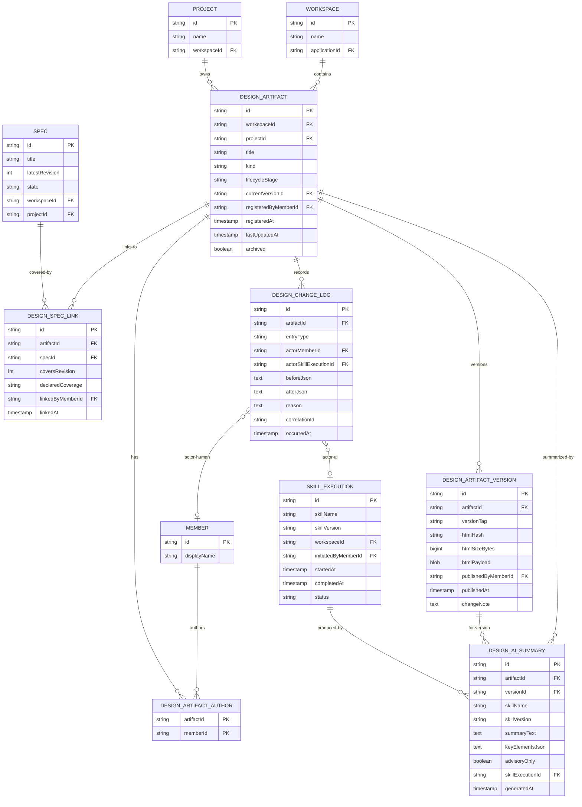

# Design Management Data Model

## Purpose

Defines the domain model, frontend types, backend DTOs / JPA entities, and database schema (DDL) for the Design Management slice. Reuses existing entities from [requirement-data-model.md](requirement-data-model.md) and [project-space-data-model.md](project-space-data-model.md) for Spec and Project identity. Introduces four net-new entities plus a change-log entity.

## Traceability

- Requirements: [../01-requirements/design-management-requirements.md](../01-requirements/design-management-requirements.md)
- Spec: [../03-spec/design-management-spec.md](../03-spec/design-management-spec.md)
- Architecture: [design-management-architecture.md](design-management-architecture.md)
- Data flow: [design-management-data-flow.md](design-management-data-flow.md)

All Mermaid diagrams use 8.x-compatible syntax.

---

## 1. Domain Model (ER Diagram)



### 1.1 Entity notes

- `DESIGN_ARTIFACT.currentVersionId` — denormalized pointer to the most recent version for fast header reads
- `DESIGN_ARTIFACT_AUTHOR` — many-to-many join between artifact and members
- `DESIGN_ARTIFACT_VERSION.htmlPayload` — stored as a BLOB in Oracle / VARBINARY in H2; capped at 2 MB via `HtmlSanitizer`
- `DESIGN_SPEC_LINK.specId` — soft reference; Spec identity lives in Requirement domain
- `DESIGN_AI_SUMMARY.keyElementsJson` — JSON array of up to 10 strings
- `DESIGN_CHANGE_LOG` — append-only; mirrors the audit pipeline but optimized for per-artifact history queries

---

## 2. Frontend Types (TypeScript)

Located under `frontend/src/features/design-management/types/`.

### 2.1 `enums.ts`

```typescript
export const ArtifactKind = {
  PAGE_MOCK: 'PAGE_MOCK',
  COMPONENT_MOCK: 'COMPONENT_MOCK',
  FLOW_MOCK: 'FLOW_MOCK',
  STATE_MOCK: 'STATE_MOCK'
} as const
export type ArtifactKind = typeof ArtifactKind[keyof typeof ArtifactKind]

export const LifecycleStage = {
  DRAFT: 'DRAFT',
  READY_FOR_REVIEW: 'READY_FOR_REVIEW',
  APPROVED: 'APPROVED',
  DEPRECATED: 'DEPRECATED'
} as const
export type LifecycleStage = typeof LifecycleStage[keyof typeof LifecycleStage]

export const CoverageStatus = {
  OK: 'OK',
  PARTIAL: 'PARTIAL',
  STALE: 'STALE',
  MISSING: 'MISSING',
  UNKNOWN: 'UNKNOWN'
} as const
export type CoverageStatus = typeof CoverageStatus[keyof typeof CoverageStatus]

export const DeclaredCoverage = {
  FULL: 'FULL',
  PARTIAL: 'PARTIAL'
} as const
export type DeclaredCoverage = typeof DeclaredCoverage[keyof typeof DeclaredCoverage]

export const ChangeLogEntryType = {
  REGISTERED: 'REGISTERED',
  VERSION_PUBLISHED: 'VERSION_PUBLISHED',
  LINKED_SPEC: 'LINKED_SPEC',
  UNLINKED_SPEC: 'UNLINKED_SPEC',
  LIFECYCLE_CHANGED: 'LIFECYCLE_CHANGED',
  AI_SUMMARY_GENERATED: 'AI_SUMMARY_GENERATED'
} as const
export type ChangeLogEntryType = typeof ChangeLogEntryType[keyof typeof ChangeLogEntryType]
```

### 2.2 `catalog.ts`

```typescript
import { ArtifactKind, LifecycleStage, CoverageStatus } from './enums'

export interface MemberRef {
  memberId: string
  displayName: string
}

export interface CatalogRow {
  artifactId: string
  workspaceId: string
  projectId: string
  projectName: string
  title: string
  kind: ArtifactKind
  lifecycleStage: LifecycleStage
  authors: MemberRef[]
  currentVersionId: string
  currentVersionTag: string
  lastUpdatedAt: string // ISO-8601
  linkedSpecCount: number
  worstCoverageStatus: CoverageStatus
  aiSummaryReady: boolean
  previewThumbnailUrl: string | null
}

export interface CatalogSummary {
  workspaceId: string
  totalArtifacts: number
  artifactsWithLinks: number
  orphanArtifacts: number
  missingDesigns: number
  staleArtifacts: number
  lastRefreshedAt: string
  aiLinkageAdvisory: string | null
}

export interface CatalogFilters {
  project?: string
  kind?: ArtifactKind
  lifecycleStage?: LifecycleStage
  coverage?: CoverageStatus
  author?: string
  q?: string
  sort?: 'last_updated_desc' | 'title_asc' | 'linked_count_desc' | 'coverage_desc'
}
```

### 2.3 `viewer.ts`

```typescript
import { ArtifactKind, LifecycleStage, CoverageStatus, DeclaredCoverage, ChangeLogEntryType } from './enums'
import { MemberRef } from './catalog'

export interface ArtifactHeader {
  artifactId: string
  workspaceId: string
  projectId: string
  projectName: string
  title: string
  kind: ArtifactKind
  lifecycleStage: LifecycleStage
  authors: MemberRef[]
  currentVersionId: string
  currentVersionTag: string
  registeredAt: string
  registeredBy: MemberRef
  lastUpdatedAt: string
}

export interface LinkedSpec {
  linkId: string
  specId: string
  specTitle: string
  coverageStatus: CoverageStatus
  declaredCoverage: DeclaredCoverage
  coversRevision: number
  specLatestRevision: number
  linkedAt: string
  linkedBy: MemberRef
}

export interface AiSummary {
  summaryId: string
  artifactId: string
  versionId: string
  versionTag: string
  skillName: string
  skillVersion: string
  summaryText: string
  keyElements: string[]
  generatedAt: string
  advisoryOnly: boolean
}

export interface ChangeLogEntry {
  entryId: string
  artifactId: string
  entryType: ChangeLogEntryType
  actor: { kind: 'HUMAN'; member: MemberRef } | { kind: 'AI'; skillName: string; skillVersion: string; skillExecutionId: string }
  description: string
  relatedSpecId?: string
  occurredAt: string
  correlationId: string
}

export interface ChangeLogPage {
  entries: ChangeLogEntry[]
  page: number
  pageSize: number
  total: number
}

export interface ViewerAggregate {
  header: SectionResult<ArtifactHeader>
  links: SectionResult<LinkedSpec[]>
  aiSummary: SectionResult<AiSummary | null>
  history: SectionResult<ChangeLogPage>
}
```

### 2.4 `traceability.ts`

```typescript
import { CoverageStatus } from './enums'

export interface TraceabilityArtifactRef {
  artifactId: string
  title: string
  currentVersionTag: string
  coverageStatus: CoverageStatus
}

export interface TraceabilitySpecRow {
  specId: string
  specTitle: string
  projectId: string
  projectName: string
  specLatestRevision: number
  specState: string
  linkedArtifacts: TraceabilityArtifactRef[]
  coverageSummary: Record<CoverageStatus, number>
}

export interface TraceabilityFilters {
  workspaceId?: string
  specId?: string
  coverage?: CoverageStatus
  project?: string
  sort?: 'missing_first' | 'spec_id_asc' | 'project_asc'
}
```

### 2.5 `requests.ts`

```typescript
import { ArtifactKind, LifecycleStage, DeclaredCoverage } from './enums'

export interface RegisterArtifactRequest {
  workspaceId: string
  projectId: string
  title: string
  kind: ArtifactKind
  lifecycleStage?: LifecycleStage // default DRAFT
  authorMemberIds: string[]
  htmlPayload: string              // inline
  htmlPath?: string                // alternative to payload: docs/standard-sdd/05-design/*.html reference
  initialSpecLinks?: Array<{
    specId: string
    declaredCoverage: DeclaredCoverage
  }>
}

export interface PublishVersionRequest {
  prevVersionId: string            // fencing token
  htmlPayload: string
  changeNote?: string
}

export interface LinkSpecsRequest {
  links: Array<{
    specId: string
    declaredCoverage: DeclaredCoverage
  }>
}

export interface ChangeLifecycleRequest {
  toStage: LifecycleStage
  reason?: string
}
```

### 2.6 `section.ts` (imported, shared)

```typescript
// Reused from src/shared/types/section.ts — not redefined here
export type SectionStatus = 'OK' | 'LOADING' | 'EMPTY' | 'ERROR'

export interface SectionError {
  code: string
  message: string
  correlationId: string
}

export interface SectionResult<T> {
  status: SectionStatus
  data: T | null
  error: SectionError | null
  fetchedAt: string
}
```

---

## 3. Backend DTOs (Java)

Located under `com.sdlctower.domain.designmanagement.dto`.

### 3.1 Enums

```java
public enum ArtifactKind { PAGE_MOCK, COMPONENT_MOCK, FLOW_MOCK, STATE_MOCK }
public enum LifecycleStage { DRAFT, READY_FOR_REVIEW, APPROVED, DEPRECATED }
public enum CoverageStatus { OK, PARTIAL, STALE, MISSING, UNKNOWN }
public enum DeclaredCoverage { FULL, PARTIAL }
public enum ChangeLogEntryType {
  REGISTERED, VERSION_PUBLISHED, LINKED_SPEC, UNLINKED_SPEC,
  LIFECYCLE_CHANGED, AI_SUMMARY_GENERATED
}
```

### 3.2 Catalog DTOs

```java
public record MemberRefDto(String memberId, String displayName) {}

public record CatalogRowDto(
  String artifactId,
  String workspaceId,
  String projectId,
  String projectName,
  String title,
  ArtifactKind kind,
  LifecycleStage lifecycleStage,
  List<MemberRefDto> authors,
  String currentVersionId,
  String currentVersionTag,
  Instant lastUpdatedAt,
  int linkedSpecCount,
  CoverageStatus worstCoverageStatus,
  boolean aiSummaryReady,
  String previewThumbnailUrl
) {}

public record CatalogSummaryDto(
  String workspaceId,
  int totalArtifacts,
  int artifactsWithLinks,
  int orphanArtifacts,
  int missingDesigns,
  int staleArtifacts,
  Instant lastRefreshedAt,
  String aiLinkageAdvisory
) {}

public record CatalogAggregateDto(
  SectionResult<List<CatalogRowDto>> rows,
  SectionResult<CatalogSummaryDto> summary
) {}
```

### 3.3 Viewer DTOs

```java
public record ArtifactHeaderDto(
  String artifactId,
  String workspaceId,
  String projectId,
  String projectName,
  String title,
  ArtifactKind kind,
  LifecycleStage lifecycleStage,
  List<MemberRefDto> authors,
  String currentVersionId,
  String currentVersionTag,
  Instant registeredAt,
  MemberRefDto registeredBy,
  Instant lastUpdatedAt
) {}

public record LinkedSpecDto(
  String linkId,
  String specId,
  String specTitle,
  CoverageStatus coverageStatus,
  DeclaredCoverage declaredCoverage,
  int coversRevision,
  int specLatestRevision,
  Instant linkedAt,
  MemberRefDto linkedBy
) {}

public record AiSummaryDto(
  String summaryId,
  String artifactId,
  String versionId,
  String versionTag,
  String skillName,
  String skillVersion,
  String summaryText,
  List<String> keyElements,
  Instant generatedAt,
  boolean advisoryOnly
) {}

public sealed interface ChangeLogActorDto permits HumanActorDto, AiActorDto {}
public record HumanActorDto(MemberRefDto member) implements ChangeLogActorDto {}
public record AiActorDto(String skillName, String skillVersion, String skillExecutionId) implements ChangeLogActorDto {}

public record ChangeLogEntryDto(
  String entryId,
  String artifactId,
  ChangeLogEntryType entryType,
  ChangeLogActorDto actor,
  String description,
  String relatedSpecId,
  Instant occurredAt,
  String correlationId
) {}

public record ChangeLogPageDto(
  List<ChangeLogEntryDto> entries,
  int page,
  int pageSize,
  long total
) {}

public record ViewerAggregateDto(
  SectionResult<ArtifactHeaderDto> header,
  SectionResult<List<LinkedSpecDto>> links,
  SectionResult<AiSummaryDto> aiSummary,
  SectionResult<ChangeLogPageDto> history
) {}
```

### 3.4 Traceability DTOs

```java
public record TraceabilityArtifactRefDto(
  String artifactId,
  String title,
  String currentVersionTag,
  CoverageStatus coverageStatus
) {}

public record TraceabilitySpecRowDto(
  String specId,
  String specTitle,
  String projectId,
  String projectName,
  int specLatestRevision,
  String specState,
  List<TraceabilityArtifactRefDto> linkedArtifacts,
  Map<CoverageStatus, Integer> coverageSummary
) {}

public record TraceabilityDto(
  List<TraceabilitySpecRowDto> rows
) {}
```

### 3.5 Command DTOs

```java
public record RegisterArtifactRequest(
  String workspaceId,
  String projectId,
  String title,
  ArtifactKind kind,
  LifecycleStage lifecycleStage,   // nullable → default DRAFT
  List<String> authorMemberIds,
  String htmlPayload,              // nullable iff htmlPath provided
  String htmlPath,                 // nullable iff htmlPayload provided
  List<InitialSpecLinkRequest> initialSpecLinks
) {}

public record InitialSpecLinkRequest(
  String specId,
  DeclaredCoverage declaredCoverage
) {}

public record PublishVersionRequest(
  String prevVersionId,            // fencing token
  String htmlPayload,
  String changeNote
) {}

public record LinkSpecsRequest(
  List<LinkSpecItem> links
) {}

public record LinkSpecItem(
  String specId,
  DeclaredCoverage declaredCoverage
) {}

public record ChangeLifecycleRequest(
  LifecycleStage toStage,
  String reason
) {}
```

### 3.6 Shared envelope (reused)

```java
// Already defined in com.sdlctower.shared.api.SectionResult
public record SectionResult<T>(
  SectionStatus status,
  T data,
  SectionError error,
  Instant fetchedAt
) {}

public enum SectionStatus { OK, LOADING, EMPTY, ERROR }

public record SectionError(String code, String message, String correlationId) {}

public record ApiResponse<T>(
  boolean success,
  T data,
  SectionError error,
  String correlationId,
  Instant timestamp
) {}
```

---

## 4. JPA Entities (Java)

Located under `com.sdlctower.domain.designmanagement.persistence`.

```java
@Entity
@Table(name = "design_artifact", indexes = {
  @Index(name = "idx_da_workspace", columnList = "workspace_id"),
  @Index(name = "idx_da_project", columnList = "project_id"),
  @Index(name = "idx_da_kind", columnList = "kind"),
  @Index(name = "idx_da_lifecycle", columnList = "lifecycle_stage")
})
public class DesignArtifactEntity {
  @Id @Column(name = "id") private String id;
  @Column(name = "workspace_id", nullable = false) private String workspaceId;
  @Column(name = "project_id", nullable = false) private String projectId;
  @Column(name = "title", nullable = false, length = 255) private String title;
  @Enumerated(EnumType.STRING) @Column(name = "kind", nullable = false, length = 32) private ArtifactKind kind;
  @Enumerated(EnumType.STRING) @Column(name = "lifecycle_stage", nullable = false, length = 32) private LifecycleStage lifecycleStage;
  @Column(name = "current_version_id") private String currentVersionId;
  @Column(name = "registered_by_member_id", nullable = false) private String registeredByMemberId;
  @Column(name = "registered_at", nullable = false) private Instant registeredAt;
  @Column(name = "last_updated_at", nullable = false) private Instant lastUpdatedAt;
  @Column(name = "archived", nullable = false) private boolean archived;
  @Version @Column(name = "row_version") private long rowVersion;
}

@Entity
@Table(name = "design_artifact_author")
@IdClass(DesignArtifactAuthorId.class)
public class DesignArtifactAuthorEntity {
  @Id @Column(name = "artifact_id") private String artifactId;
  @Id @Column(name = "member_id") private String memberId;
  @Column(name = "added_at", nullable = false) private Instant addedAt;
}

@Entity
@Table(name = "design_artifact_version", indexes = {
  @Index(name = "idx_dav_artifact", columnList = "artifact_id"),
  @Index(name = "idx_dav_published_at", columnList = "published_at")
})
public class DesignArtifactVersionEntity {
  @Id @Column(name = "id") private String id;
  @Column(name = "artifact_id", nullable = false) private String artifactId;
  @Column(name = "version_tag", nullable = false, length = 16) private String versionTag;
  @Column(name = "html_hash", nullable = false, length = 128) private String htmlHash;
  @Column(name = "html_size_bytes", nullable = false) private long htmlSizeBytes;
  @Lob @Column(name = "html_payload", nullable = false) private byte[] htmlPayload;
  @Column(name = "published_by_member_id", nullable = false) private String publishedByMemberId;
  @Column(name = "published_at", nullable = false) private Instant publishedAt;
  @Column(name = "change_note", length = 2000) private String changeNote;
}

@Entity
@Table(name = "design_spec_link", indexes = {
  @Index(name = "idx_dsl_artifact", columnList = "artifact_id"),
  @Index(name = "idx_dsl_spec", columnList = "spec_id"),
  @Index(name = "uq_dsl_artifact_spec", columnList = "artifact_id,spec_id", unique = true)
})
public class DesignSpecLinkEntity {
  @Id @Column(name = "id") private String id;
  @Column(name = "artifact_id", nullable = false) private String artifactId;
  @Column(name = "spec_id", nullable = false) private String specId;
  @Column(name = "covers_revision", nullable = false) private int coversRevision;
  @Enumerated(EnumType.STRING) @Column(name = "declared_coverage", nullable = false, length = 16) private DeclaredCoverage declaredCoverage;
  @Column(name = "linked_by_member_id", nullable = false) private String linkedByMemberId;
  @Column(name = "linked_at", nullable = false) private Instant linkedAt;
}

@Entity
@Table(name = "design_ai_summary", indexes = {
  @Index(name = "idx_das_artifact_version", columnList = "artifact_id,version_id", unique = true),
  @Index(name = "idx_das_skill_version", columnList = "skill_name,skill_version")
})
public class DesignAiSummaryEntity {
  @Id @Column(name = "id") private String id;
  @Column(name = "artifact_id", nullable = false) private String artifactId;
  @Column(name = "version_id", nullable = false) private String versionId;
  @Column(name = "skill_name", nullable = false, length = 128) private String skillName;
  @Column(name = "skill_version", nullable = false, length = 32) private String skillVersion;
  @Lob @Column(name = "summary_text", nullable = false) private String summaryText;
  @Lob @Column(name = "key_elements_json", nullable = false) private String keyElementsJson;
  @Column(name = "advisory_only", nullable = false) private boolean advisoryOnly;
  @Column(name = "skill_execution_id") private String skillExecutionId;
  @Column(name = "generated_at", nullable = false) private Instant generatedAt;
}

@Entity
@Table(name = "design_change_log", indexes = {
  @Index(name = "idx_dcl_artifact", columnList = "artifact_id"),
  @Index(name = "idx_dcl_occurred_at", columnList = "occurred_at")
})
public class DesignChangeLogEntity {
  @Id @Column(name = "id") private String id;
  @Column(name = "artifact_id", nullable = false) private String artifactId;
  @Enumerated(EnumType.STRING) @Column(name = "entry_type", nullable = false, length = 32) private ChangeLogEntryType entryType;
  @Column(name = "actor_member_id") private String actorMemberId;
  @Column(name = "actor_skill_execution_id") private String actorSkillExecutionId;
  @Lob @Column(name = "before_json") private String beforeJson;
  @Lob @Column(name = "after_json") private String afterJson;
  @Column(name = "reason", length = 2000) private String reason;
  @Column(name = "related_spec_id") private String relatedSpecId;
  @Column(name = "correlation_id", nullable = false, length = 64) private String correlationId;
  @Column(name = "occurred_at", nullable = false) private Instant occurredAt;
}
```

---

## 5. Database Schema (DDL)

All DDL ships as Flyway migrations in `backend/src/main/resources/db/migration/`. Per CLAUDE.md Lesson #4, no `ddl-auto` for schema changes.

Migration prefixes: `V30__` through `V36__` (following the established project-management range V20–V26).

### 5.1 V30 — design_artifact

```sql
-- V30__design_management_artifact.sql
CREATE TABLE design_artifact (
  id                        VARCHAR2(64)   NOT NULL,
  workspace_id              VARCHAR2(64)   NOT NULL,
  project_id                VARCHAR2(64)   NOT NULL,
  title                     VARCHAR2(255)  NOT NULL,
  kind                      VARCHAR2(32)   NOT NULL,
  lifecycle_stage           VARCHAR2(32)   NOT NULL,
  current_version_id        VARCHAR2(64),
  registered_by_member_id   VARCHAR2(64)   NOT NULL,
  registered_at             TIMESTAMP      NOT NULL,
  last_updated_at           TIMESTAMP      NOT NULL,
  archived                  NUMBER(1)      DEFAULT 0 NOT NULL,
  row_version               NUMBER(19)     DEFAULT 0 NOT NULL,
  CONSTRAINT pk_design_artifact PRIMARY KEY (id),
  CONSTRAINT chk_da_kind CHECK (kind IN ('PAGE_MOCK','COMPONENT_MOCK','FLOW_MOCK','STATE_MOCK')),
  CONSTRAINT chk_da_lifecycle CHECK (lifecycle_stage IN ('DRAFT','READY_FOR_REVIEW','APPROVED','DEPRECATED'))
);
CREATE INDEX idx_da_workspace ON design_artifact (workspace_id);
CREATE INDEX idx_da_project   ON design_artifact (project_id);
CREATE INDEX idx_da_kind      ON design_artifact (kind);
CREATE INDEX idx_da_lifecycle ON design_artifact (lifecycle_stage);
```

### 5.2 V31 — design_artifact_author

```sql
-- V31__design_management_author.sql
CREATE TABLE design_artifact_author (
  artifact_id   VARCHAR2(64) NOT NULL,
  member_id     VARCHAR2(64) NOT NULL,
  added_at      TIMESTAMP    NOT NULL,
  CONSTRAINT pk_design_artifact_author PRIMARY KEY (artifact_id, member_id),
  CONSTRAINT fk_daa_artifact FOREIGN KEY (artifact_id) REFERENCES design_artifact(id)
);
```

### 5.3 V32 — design_artifact_version

```sql
-- V32__design_management_version.sql
CREATE TABLE design_artifact_version (
  id                        VARCHAR2(64)    NOT NULL,
  artifact_id               VARCHAR2(64)    NOT NULL,
  version_tag               VARCHAR2(16)    NOT NULL,
  html_hash                 VARCHAR2(128)   NOT NULL,
  html_size_bytes           NUMBER(19)      NOT NULL,
  html_payload              BLOB            NOT NULL,
  published_by_member_id    VARCHAR2(64)    NOT NULL,
  published_at              TIMESTAMP       NOT NULL,
  change_note               VARCHAR2(2000),
  CONSTRAINT pk_design_artifact_version PRIMARY KEY (id),
  CONSTRAINT fk_dav_artifact FOREIGN KEY (artifact_id) REFERENCES design_artifact(id),
  CONSTRAINT chk_dav_size CHECK (html_size_bytes <= 2097152)
);
CREATE INDEX idx_dav_artifact     ON design_artifact_version (artifact_id);
CREATE INDEX idx_dav_published_at ON design_artifact_version (published_at);
```

Note: for H2 local dev, replace `BLOB` with `VARBINARY` and `NUMBER(1)`/`NUMBER(19)` with `BOOLEAN`/`BIGINT`. Supply per-dialect Flyway scripts if needed (see `backend/src/main/resources/db/migration/h2/` convention).

### 5.4 V33 — design_spec_link

```sql
-- V33__design_management_link.sql
CREATE TABLE design_spec_link (
  id                     VARCHAR2(64) NOT NULL,
  artifact_id            VARCHAR2(64) NOT NULL,
  spec_id                VARCHAR2(64) NOT NULL,
  covers_revision        NUMBER(10)   NOT NULL,
  declared_coverage      VARCHAR2(16) NOT NULL,
  linked_by_member_id    VARCHAR2(64) NOT NULL,
  linked_at              TIMESTAMP    NOT NULL,
  CONSTRAINT pk_design_spec_link PRIMARY KEY (id),
  CONSTRAINT fk_dsl_artifact FOREIGN KEY (artifact_id) REFERENCES design_artifact(id),
  CONSTRAINT chk_dsl_declared CHECK (declared_coverage IN ('FULL','PARTIAL'))
);
CREATE INDEX idx_dsl_artifact ON design_spec_link (artifact_id);
CREATE INDEX idx_dsl_spec     ON design_spec_link (spec_id);
CREATE UNIQUE INDEX uq_dsl_artifact_spec ON design_spec_link (artifact_id, spec_id);
```

### 5.5 V34 — design_ai_summary

```sql
-- V34__design_management_ai_summary.sql
CREATE TABLE design_ai_summary (
  id                      VARCHAR2(64)   NOT NULL,
  artifact_id             VARCHAR2(64)   NOT NULL,
  version_id              VARCHAR2(64)   NOT NULL,
  skill_name              VARCHAR2(128)  NOT NULL,
  skill_version           VARCHAR2(32)   NOT NULL,
  summary_text            CLOB           NOT NULL,
  key_elements_json       CLOB           NOT NULL,
  advisory_only           NUMBER(1)      DEFAULT 0 NOT NULL,
  skill_execution_id      VARCHAR2(64),
  generated_at            TIMESTAMP      NOT NULL,
  CONSTRAINT pk_design_ai_summary PRIMARY KEY (id),
  CONSTRAINT fk_das_artifact FOREIGN KEY (artifact_id) REFERENCES design_artifact(id),
  CONSTRAINT fk_das_version FOREIGN KEY (version_id) REFERENCES design_artifact_version(id)
);
CREATE UNIQUE INDEX uq_das_artifact_version ON design_ai_summary (artifact_id, version_id);
CREATE INDEX idx_das_skill_version ON design_ai_summary (skill_name, skill_version);
```

### 5.6 V35 — design_change_log

```sql
-- V35__design_management_change_log.sql
CREATE TABLE design_change_log (
  id                           VARCHAR2(64)  NOT NULL,
  artifact_id                  VARCHAR2(64)  NOT NULL,
  entry_type                   VARCHAR2(32)  NOT NULL,
  actor_member_id              VARCHAR2(64),
  actor_skill_execution_id     VARCHAR2(64),
  before_json                  CLOB,
  after_json                   CLOB,
  reason                       VARCHAR2(2000),
  related_spec_id              VARCHAR2(64),
  correlation_id               VARCHAR2(64)  NOT NULL,
  occurred_at                  TIMESTAMP     NOT NULL,
  CONSTRAINT pk_design_change_log PRIMARY KEY (id),
  CONSTRAINT fk_dcl_artifact FOREIGN KEY (artifact_id) REFERENCES design_artifact(id),
  CONSTRAINT chk_dcl_entry_type CHECK (entry_type IN (
    'REGISTERED','VERSION_PUBLISHED','LINKED_SPEC','UNLINKED_SPEC',
    'LIFECYCLE_CHANGED','AI_SUMMARY_GENERATED'
  ))
);
CREATE INDEX idx_dcl_artifact    ON design_change_log (artifact_id);
CREATE INDEX idx_dcl_occurred_at ON design_change_log (occurred_at);
```

### 5.7 V36 — seed data (dev/local only)

```sql
-- V36__design_management_seed.sql
-- Executed in local H2 / dev profiles only (Flyway placeholder or environment gate)
INSERT INTO design_artifact (id, workspace_id, project_id, title, kind, lifecycle_stage,
  current_version_id, registered_by_member_id, registered_at, last_updated_at, archived, row_version)
VALUES
  ('da-seed-ct', 'ws-demo-1', 'proj-demo-dashboard', 'Control Tower Dashboard', 'PAGE_MOCK', 'APPROVED',
   'dav-seed-ct-v1', 'mem-seed-admin', SYSTIMESTAMP, SYSTIMESTAMP, 0, 0),
  ('da-seed-icc', 'ws-demo-1', 'proj-demo-incident', 'Incident Command Center', 'PAGE_MOCK', 'APPROVED',
   'dav-seed-icc-v1', 'mem-seed-admin', SYSTIMESTAMP, SYSTIMESTAMP, 0, 0),
  ('da-seed-pc', 'ws-demo-1', 'proj-demo-platform', 'Platform Center', 'PAGE_MOCK', 'READY_FOR_REVIEW',
   'dav-seed-pc-v1', 'mem-seed-admin', SYSTIMESTAMP, SYSTIMESTAMP, 0, 0),
  ('da-seed-ps', 'ws-demo-1', 'proj-demo-project-space', 'Project Space', 'PAGE_MOCK', 'APPROVED',
   'dav-seed-ps-v1', 'mem-seed-admin', SYSTIMESTAMP, SYSTIMESTAMP, 0, 0);

-- Versions, authors, spec links seeded with matching ids; omitted for brevity
```

---

## 6. Type Mapping (Frontend ↔ Backend)

| Frontend TS | Backend Java | DB Column | Notes |
|-------------|-------------|-----------|-------|
| `string` (id) | `String` | `VARCHAR2(64)` | All entity IDs |
| `string` (title) | `String` | `VARCHAR2(255)` | |
| `ArtifactKind` enum | `ArtifactKind` enum | `VARCHAR2(32)` | Stored as string |
| `LifecycleStage` enum | `LifecycleStage` enum | `VARCHAR2(32)` | Stored as string |
| `CoverageStatus` enum | `CoverageStatus` enum | — | Not persisted; computed |
| `DeclaredCoverage` enum | `DeclaredCoverage` enum | `VARCHAR2(16)` | |
| `ChangeLogEntryType` enum | `ChangeLogEntryType` enum | `VARCHAR2(32)` | |
| `number` (revision) | `int` | `NUMBER(10)` | Spec revision is small |
| `number` (bytes) | `long` | `NUMBER(19)` | 2 MB cap but long-typed |
| `string` (ISO-8601) | `Instant` | `TIMESTAMP` | UTC, no time zone |
| `string` (summaryText) | `String` | `CLOB` | May exceed 4KB |
| `string[]` (keyElements) | `List<String>` | `CLOB` (JSON) | Serialized JSON array |
| `MemberRef` | `MemberRefDto` | — | Joined from Member domain |
| `boolean` (aiSummaryReady, advisoryOnly, archived) | `boolean` | `NUMBER(1)` | 0/1 in Oracle, BOOLEAN in H2 |

---

## 7. Indexes, Constraints, and Data Integrity

- `design_artifact` — indexed by `workspace_id`, `project_id`, `kind`, `lifecycle_stage` for catalog filtering
- `design_artifact_version` — `(artifact_id)` and `(published_at)` indexes for viewer header and history
- `design_spec_link` — unique index on `(artifact_id, spec_id)` to enforce idempotency (B11 in spec)
- `design_ai_summary` — unique index on `(artifact_id, version_id)` to ensure one cached summary per version
- `design_change_log` — indexed by `artifact_id` and `occurred_at` for per-artifact history pagination
- `CHECK` constraints on every enum column
- `CHECK (html_size_bytes <= 2097152)` enforces the 2 MB cap at DB layer (belt + suspenders with application-layer enforcement)
- `FOREIGN KEY` constraints cascade: `design_artifact_version`, `design_spec_link`, `design_ai_summary`, `design_change_log` all reference `design_artifact(id)`; artifact deletion is NOT supported in V1 (use `archived=1`)

---

## 8. Data Volumes & Growth

| Entity | V1 design target | V2 concern |
|--------|------------------|------------|
| `design_artifact` | ≤ 200 per Workspace | Pagination, archival |
| `design_artifact_version` | ≤ 20 versions per artifact | Version pruning policy |
| `design_spec_link` | ≤ 10 links per artifact | — |
| `design_ai_summary` | 1 per artifact version | Skill-version migration |
| `design_change_log` | unbounded (append-only) | Retention window (default 3 years) |

---

## 9. Privacy & PII Posture

- `design_artifact_version.html_payload` is treated as potentially sensitive — access requires the same role check as the artifact itself
- `PiiScanner` blocks registration / publish if email, national-ID, or credit-card regexes match the payload
- Logs NEVER capture `html_payload`, `summary_text`, or `key_elements_json` content — only IDs and metadata
- Change log `before_json` and `after_json` for `VERSION_PUBLISHED` entries capture `{versionId, htmlHash, sizeBytes, changeNote}` — NOT the HTML payload itself

---

## 10. Migration & Rollback

Each V30–V36 migration is additive and reversible via an explicit `U{N}__design_management_*.sql` undo script. V1 does not perform data destructive operations; rollback is limited to `DROP TABLE` for empty environments.

Per CLAUDE.md Lesson #4: no `ddl-auto`, Flyway only, H2 and Oracle DDL parity preserved via per-dialect folders where needed.
