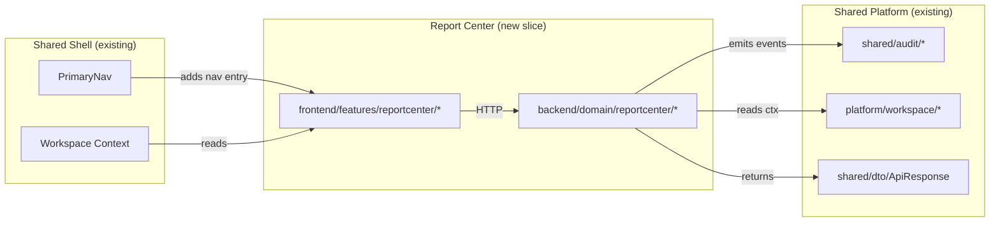

# Report Center Design

## Purpose

Concrete implementation-level design for the **Report Center** slice:
file structure, component APIs, data contracts, visual decisions, DB
schema summary, error / empty states, and integration boundary.

## Upstream Inputs

- [`report-center-requirements.md`](../01-requirements/report-center-requirements.md)
- [`report-center-stories.md`](../02-user-stories/report-center-stories.md)
- [`report-center-spec.md`](../03-spec/report-center-spec.md)
- [`report-center-architecture.md`](../04-architecture/report-center-architecture.md)
- [`report-center-data-flow.md`](../04-architecture/report-center-data-flow.md)
- [`report-center-data-model.md`](../04-architecture/report-center-data-model.md)

## Companion contracts

- [`report-center-API_IMPLEMENTATION_GUIDE.md`](./contracts/report-center-API_IMPLEMENTATION_GUIDE.md) — full HTTP contracts

---

## 1. Visual Design Decisions

### 1.1 Surface identity

Report Center must feel **distinct from Dashboard** (REQ-RPT-03, RPT-S02):

| Facet | Dashboard | Report Center |
|-------|-----------|---------------|
| Page header label | `Live` badge | `History` badge |
| Typography accent | accent.live (warm) | accent.history (cool) |
| Data freshness label | "Live — updated 3s ago" | "Data as of: 12 min ago" |
| Primary call to action | Drill to module | Configure filter → render → export |
| Refresh behavior | Periodic auto | On-demand only |

### 1.2 Tokens

Reuse the existing design system tokens (see `visual-design-system.md`). Report
Center introduces one semantic variant:

```css
--accent-history: var(--color-steel-600);   /* cool, historical */
--accent-history-bg: var(--color-steel-50);
--surface-report: var(--color-surface-2);
```

### 1.3 Chart styling

- ECharts 5.x theme extends the platform design system (colors, grid,
  tooltip).
- Series colors follow the existing categorical palette from `visual-design-system.md`.
- No color-only signal: every series has a distinct dash or marker pattern
  (REQ-RPT-82 accessibility).

### 1.4 Motion

- Chart enter animation: 240ms `ease-out`, first paint only.
- Filter change re-render: 120ms `linear` crossfade on chart, no flash on
  drilldown (diff-aware render via @tanstack/vue-table).
- Loading skeletons: 1.4s shimmer loop.

### 1.5 Density

Drilldown table uses the shared "dense" row height (32px) because reports
are scanned, not browsed.

---

## 2. Frontend File Structure

```
frontend/src/features/reportcenter/
├── index.ts                          # feature barrel: routes, types, store
├── routes.ts                         # route definitions
├── types.ts                          # all frontend types (see data-model §2)
├── api/
│   ├── reportCenterApi.ts            # thin client over shared fetchJson
│   └── mockReports.ts                # phase A mock
├── stores/
│   └── reportCenterStore.ts          # Pinia store
├── views/
│   ├── ReportCatalogView.vue         # /reports
│   └── ReportDetailView.vue          # /reports/:reportKey
├── components/
│   ├── catalog/
│   │   ├── ReportCategoryGroup.vue
│   │   ├── ReportCard.vue
│   │   ├── HistoryList.vue
│   │   └── ExportsList.vue
│   ├── filter/
│   │   ├── FilterForm.vue
│   │   ├── ScopeSelector.vue
│   │   ├── TimeRangeSelector.vue
│   │   ├── EntityMultiSelect.vue
│   │   └── GroupingSelector.vue
│   ├── result/
│   │   ├── HeadlineStrip.vue
│   │   ├── ChartSection.vue
│   │   ├── DrilldownSection.vue
│   │   ├── SectionError.vue
│   │   └── SectionSkeleton.vue
│   ├── charts/
│   │   ├── HistogramChart.vue
│   │   ├── StackedBarChart.vue
│   │   ├── GroupedBarChart.vue
│   │   ├── HeatmapChart.vue
│   │   └── HorizontalBarChart.vue
│   └── export/
│       ├── ExportActions.vue
│       └── ExportJobToast.vue
└── __tests__/
    ├── FilterForm.spec.ts
    ├── HeadlineStrip.spec.ts
    └── reportCenterStore.spec.ts
```

---

## 3. Backend File Structure

```
backend/src/main/java/com/sdlctower/domain/reportcenter/
├── ReportCenterController.java
├── ReportCatalogService.java
├── ReportRunService.java
├── ReportExportService.java
├── ReportHistoryService.java
├── ExportWorker.java
├── ScopeAuthGuard.java
├── definitions/
│   ├── ReportDefinitionRegistry.java
│   ├── ReportDefinition.java                 # compile-time value type
│   ├── efficiency/
│   │   ├── LeadTimeReport.java
│   │   ├── CycleTimeReport.java
│   │   ├── ThroughputReport.java
│   │   ├── WipReport.java
│   │   └── FlowEfficiencyReport.java
├── render/
│   ├── PdfRenderer.java
│   └── CsvWriter.java
├── storage/
│   ├── ArtifactStore.java                    # interface
│   └── LocalFsArtifactStore.java             # V1 impl (env-profile gated)
├── dto/                                      # see data-model §3
│   ├── SectionResultDto.java
│   ├── ReportDefinitionDto.java
│   ├── DrilldownColumnSpec.java
│   ├── CatalogDto.java
│   ├── TimeRangeDto.java
│   ├── ReportRunRequestDto.java
│   ├── HeadlineMetricDto.java
│   ├── SeriesPointDto.java
│   ├── DrilldownDto.java
│   ├── ReportRunResultDto.java
│   ├── ExportJobDto.java
│   ├── ReportRunHistoryEntryDto.java
│   └── ReportExportHistoryEntryDto.java
├── entity/
│   ├── ReportRun.java
│   └── ReportExport.java
├── repository/
│   ├── ReportRunRepository.java
│   ├── ReportExportRepository.java
│   ├── LeadTimeFactRepository.java
│   ├── CycleTimeFactRepository.java
│   ├── ThroughputFactRepository.java
│   ├── WipFactRepository.java
│   └── FlowEfficiencyFactRepository.java
└── config/
    ├── ReportAsyncConfig.java                 # @EnableAsync + executor
    └── ReportDefinitionsConfig.java           # registers all definitions
```

---

## 4. Component APIs (Frontend)

### 4.1 `ReportCatalogView`

**Route:** `/reports`
**Query params:** `tab` = `catalog` (default) | `history` | `exports`

**Data dependencies:**

- `reportCenterStore.catalog` — fetched on mount
- `reportCenterStore.history` — fetched when `tab=history` activated
- `reportCenterStore.exports` — fetched when `tab=exports` activated

### 4.2 `ReportDetailView`

**Route:** `/reports/:reportKey`
**Query params:** filter state (see data-flow §6)

**Slots / sub-components:**

```
<ReportDetailView>
  <FilterForm v-model:request="request" :definition="def" @apply="run"/>
  <template v-if="hasResult">
    <HeadlineStrip :result="result"/>
    <ChartSection :result="result" :chart-type="def.chartType"/>
    <DrilldownSection :result="result"/>
    <ExportActions :request="request" :run-id="result.runId"/>
  </template>
</ReportDetailView>
```

### 4.3 `FilterForm`

**Props:**

```typescript
interface FilterFormProps {
  definition: ReportDefinitionDto;   // defines available scopes/groupings
  modelValue: ReportRunRequest;      // current request
}
```

**Emits:**

- `update:modelValue` — new request as user edits
- `apply` — user clicked "Apply" (validation passed)
- `reset` — user clicked "Reset"

### 4.4 `ChartSection`

**Props:**

```typescript
interface ChartSectionProps {
  section: SectionResult<SeriesPoint[]>;
  chartType: ChartType;
  loading: boolean;
}
```

**Behavior:**

- `loading=true` → `SectionSkeleton`
- `section.error` → `SectionError` with retry event
- `section.data` → route to appropriate chart component

### 4.5 `DrilldownSection`

**Props:**

```typescript
interface DrilldownSectionProps {
  section: SectionResult<{ columns: DrilldownColumnSpec[]; rows: DrilldownRow[]; totalRows: number }>;
  loading: boolean;
}
```

**Behavior:**

- Virtualized rows via `@tanstack/vue-table`.
- Shows `totalRows` at bottom with "Showing X of Y" when > 500 rows.

### 4.6 `ExportActions`

**Props:**

```typescript
interface ExportActionsProps {
  request: ReportRunRequest;
  reportKey: string;
  reportRunId?: string;  // required; disabled without a run
}
```

**Emits:**

- `exported` — `{ exportId, format }` when API accepts

Dropdown with CSV and PDF entries. On click → POST export → toast job →
poll via store.

---

## 5. Backend Component APIs

### 5.1 `ReportCenterController`

```java
@RestController
@RequestMapping("/api/v1/reports")
public class ReportCenterController {

  @GetMapping("/catalog")
  public ApiResponse<CatalogDto> getCatalog() { ... }

  @PostMapping("/{reportKey}/run")
  public ApiResponse<ReportRunResultDto> run(
      @PathVariable String reportKey,
      @Valid @RequestBody ReportRunRequestDto request) { ... }

  @PostMapping("/{reportKey}/export")
  public ResponseEntity<ApiResponse<ExportJobDto>> export(
      @PathVariable String reportKey,
      @Valid @RequestBody ReportRunRequestDto request,
      @RequestParam String format) { ... }  // returns 202

  @GetMapping("/exports/{exportId}")
  public ApiResponse<ExportJobDto> getExport(@PathVariable String exportId) { ... }

  @GetMapping("/history")
  public ApiResponse<List<ReportRunHistoryEntryDto>> getHistory(
      @RequestParam(required = false) String reportKey) { ... }

  @GetMapping("/exports")
  public ApiResponse<List<ReportExportHistoryEntryDto>> getExportHistory() { ... }
}
```

### 5.2 `ReportDefinition` (code-defined)

```java
public interface ReportDefinition {
  String key();
  String category();
  String name();
  String description();
  List<String> supportedScopes();
  List<String> supportedGroupings();
  String defaultGrouping();
  String chartType();
  List<DrilldownColumnSpec> drilldownColumns();

  ReportRunResultDto run(ReportRunRequestDto request, ScopeContext scope);
}
```

### 5.3 `ScopeAuthGuard`

```java
@Component
public class ScopeAuthGuard {
  public ScopeContext authorize(String scope, List<String> scopeIds) {
    // looks up caller, resolves scope, throws ForbiddenException on violation
    // returns ScopeContext containing resolved IDs to apply as filter
  }
}
```

---

## 6. Visual States

### 6.1 Empty state

- Headline area: muted KPI tiles with "—" placeholder
- Chart area: centered illustration + "No data for this filter"
- Drilldown table: placeholder row reading "No results" with Reset button

### 6.2 Loading state

- Headline: skeleton tiles (3 wide)
- Chart: shimmer block (height = chart's defined height)
- Drilldown: 8 skeleton rows

### 6.3 Section error state

Each section has inline error UI — **does not** replace the whole page.

```
┌────────────────────────────────────────┐
│  Chart section                         │
│  ┌────────────────────────────────┐    │
│  │  ⚠  Unable to load chart        │    │
│  │  <error.message>               │    │
│  │  [ Retry ]                     │    │
│  └────────────────────────────────┘    │
└────────────────────────────────────────┘
```

### 6.4 Slow warning

Non-blocking banner above the report body:

```
⏱  This report took longer than expected. Consider narrowing your filter.  [ Dismiss ]
```

### 6.5 Export toast

Floating bottom-right:

```
 ▸ Generating PDF for Lead Time… [Cancel]           ← generating
 ✔ PDF ready — [Download]  [Open in new tab]         ← ready
 ✖ Export failed: <message>  [Retry]                 ← failed
```

---

## 7. Database Schema Summary

Full DDL in
[`report-center-data-model.md §5`](../04-architecture/report-center-data-model.md).

- `report_run` — each rendered run (for history)
- `report_export` — each export job + artifact metadata
- `report_fact_lead_time` — efficiency fact: lead time
- `report_fact_cycle_time` — efficiency fact: cycle time per stage
- `report_fact_throughput` — efficiency fact: items-per-week
- `report_fact_wip` — efficiency fact: WIP with aging
- `report_fact_flow_efficiency` — efficiency fact: active ÷ total time per stage

All schema changes via **Flyway** (CLAUDE.md rule 4).

---

## 8. Integration Boundary



**Do not modify** shared-shell source (except adding a nav entry) or
shared platform modules. All additions live under the new `reportcenter`
packages.

---

## 9. Permissions Model

| Endpoint | Auth required | Scope check |
|----------|---------------|-------------|
| GET /catalog | yes | filters catalog to accessible scopes |
| POST /run | yes | ScopeAuthGuard |
| POST /export | yes | ScopeAuthGuard |
| GET /exports/{id} | yes | owner-only (caller must be original requester) |
| GET /history | yes | owner-only (only caller's runs) |
| GET /exports (list) | yes | owner-only |

Download URLs are signed with a 15-minute TTL; the signature encodes
`exportId` and caller identity so stolen URLs cannot be re-used by
others.

---

## 10. Testing

### 10.1 Frontend

- `FilterForm.spec.ts` — form emits correct request payload for every
  preset; custom range validation
- `HeadlineStrip.spec.ts` — renders N tiles, trend arrows correct sign
- `ChartSection.spec.ts` — loading / error / rendered branches
- `reportCenterStore.spec.ts` — catalog fetch / run / export / poll
  state transitions

### 10.2 Backend

- `ReportCenterControllerTest` — MockMvc covering all endpoints,
  catalog + run happy path, validation failures, 403 on scope mismatch,
  413 on oversized CSV
- `ReportRunServiceTest` — each of the 5 report definitions with
  synthetic fact data, grouping variants
- `ExportWorkerTest` — CSV generation, PDF generation, failure path,
  audit event emission
- `ScopeAuthGuardTest` — org/workspace/project positive and negative cases

### 10.3 Contract parity

`ReportCenterContractTest` compares JSON response fields against a
checked-in schema fixture to guarantee the FE types stay aligned. Add to
`backend/src/test/resources/contracts/report-center/`.

---

## 11. Migration / Rollout

1. **Ship catalog + run (MVP) behind a feature flag** (e.g. a Pinia
   `useMockData=false` build toggle is sufficient in V1).
2. **Seed synthetic fact data** via Flyway migration so reports render
   in dev even without adapter feeds.
3. **Enable export after catalog/run lands** — export depends on fact
   tables being populated and on PDF renderer being deployed.
4. **Enable history tab** after export lands (depends on `report_run`
   accumulating rows in production).

No data backfill required — reports read from fact tables that adapters
populate on their own cadence.

---

## 12. Traceability

| Design section | Requirement IDs | Story IDs |
|----------------|-----------------|-----------|
| §1 Visual | REQ-RPT-01, REQ-RPT-03, REQ-RPT-82 | RPT-S02, RPT-S50 |
| §2 FE files | REQ-RPT-10..15, REQ-RPT-20..32 | RPT-S01..S22 |
| §3 BE files | Spec §1..§4 | — |
| §4 Component APIs | REQ-RPT-20..32, REQ-RPT-40..41 | RPT-S10..S31 |
| §5 Backend APIs | Spec §4 | — |
| §6 States | REQ-RPT-31, REQ-RPT-32, REQ-RPT-81 | RPT-S21, RPT-S22, RPT-S51 |
| §7 DB | CLAUDE.md rule 4 | — |
| §8 Integration | Spec §9 | — |
| §9 Permissions | REQ-RPT-70..72 | RPT-S10 |
